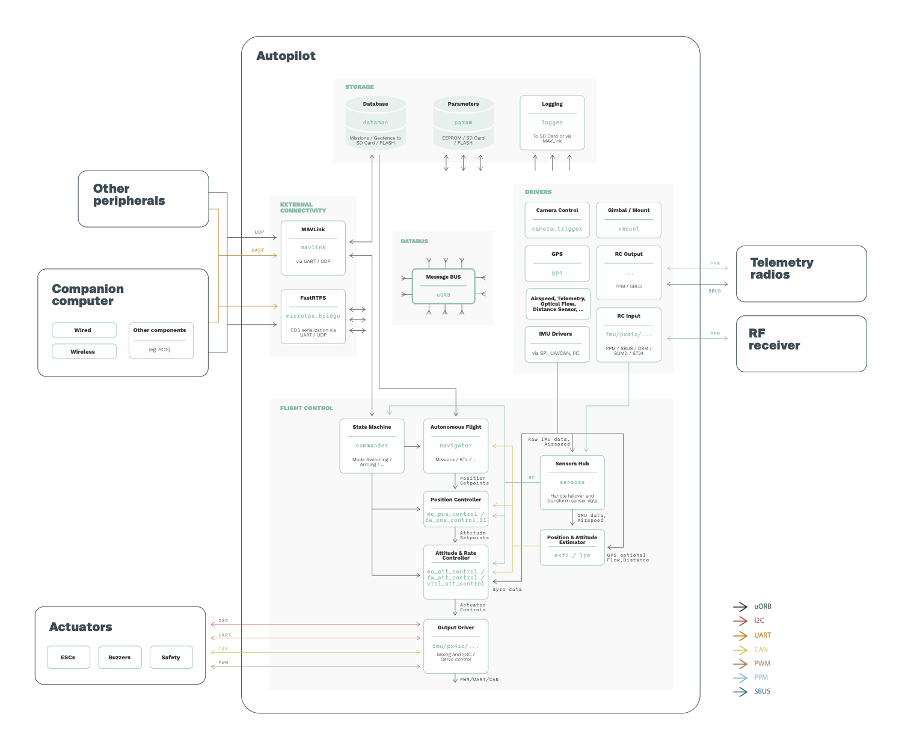

\newpage

## PX4 autopilot

The [PX4 autopilot](https://px4.io/software/software-overview/) is an open source flight autopilot for drone developers. It's advertised as a

> an open source flight control software for drones and other unmanned vehicles. The project provides a flexible set of tools for drone developers to share technologies to create tailored solutions for drone applications. PX4 provides a standard to deliver drone hardware support and software stack, allowing an ecosystem to build and maintain hardware and software in a scalable way.
>
>PX4 is part of Dronecode, a non-profit organization administered by Linux Foundation to foster the use of open source software on flying vehicles. Dronecode also hosts QGroundControl, MAVLink & the SDK.

Alternatives to PX4 include [Ardupilot (APM)](https://ardupilot.org/) and [Paparazzi](https://wiki.paparazziuav.org/wiki/Main_Page).

### Understanding the threat landscape
Let's start by performing a simple threat modeling exercise on the autopilot to understand its threat landscape:

Note that there're various communication buses and protocols depicted. Of most importance:
- [`uORB`](https://dev.px4.io/v1.10_noredirect/en/middleware/uorb.html): uORB is an asynchronous publish/subscribe messaging API maintained within the PX4 project and used for intra-process/inter-process communication. Depicted with dark arrows, most autopilot software components[^0] rely heavily on `uORB` for interactions. `uORB` is designed to be lightweight
Note how `uORB` interactions are restricted to internal software components and how **it's not directly exposed to any external interface due to its lack of security**. Thought the `uORB` communication middleware is not directly exposed, if an attacker were to use one of the exposed interfaces (e.g. through insecure peripheral communications) and were to obtain privileges to execute code within associated software components, compromising the internal architecture through uORB would be trivial.
- [MAVLink](https://mavlink.io/en/): MAVLink is a very lightweight messaging protocol for communicating with drones (and between onboard drone components) that generally interfaces with either [UART](https://mavlink.io/en/mavgen_c/example_c_uart.html) or [UDP](https://mavlink.io/en/mavgen_c/example_c_udp.html). Initially designed without security and later reviewed to add *some* security capabilities (MAVLink 2), MAVLink is widely used between a GCS and drone, and between drone autopilot and MAVLink enabled drone peripherals (e.g. a camera). The lack of a security-centric approach from its conception has led to [various reported security vulnerabilities](https://github.com/aliasrobotics/RVD/labels/robot%20component%3A%20PX4) which allows attackers to compromise the intra and inter-drone interactions[^1].
- [Micro-XRCE and DDS](https://docs.px4.io/master/en/middleware/micrortps.html): Traveling over UDP[^2], the DDS communication middleware is the alternative presented by PX4 to MAVLink. DDS provides certain security capabilities (see previous case studies) however these aspects are not translated to resource constrained DDS endpoints. In the case of few resources, OMG created a different DDS spec called DDS-XRCE which stands for eXtremely Resource Constrained Environments. Micro-XRCE is one of the implementations of DDS-XRCE. The compromised security mechanisms of DDS (discussed in previous case studies) and the [lacking security mechanisms of DDS-XRCE](https://micro.ros.org/docs/overview/ROS_2_feature_comparison/) present simple entrypoints that attacker could leverage.

[^0]: At the time of writing.
[^1]: MAVLink UDP interactions can be modeled easily using PX4 SITL wherein communication over the designated ports (e.g. with the GCS) will use MAVLink protocol.
[^2]: Most often and by default, though DDS can be configured to use TCP.

Depicting all of this again while drawing the entrypoints and a few boundaries to identify trust zones (*trust boundaries*) leads to the following:

### Static analysis of PX4 autopilot
Refer to [The cybersecurity status of PX4 — PX4 Developer Summit Virtual 2020](https://www.youtube.com/watch?v=phHYfAqjOuQ) to learn more about the results while statically analyzing PX4.

### A simulated drone for security research purposes

The best way to security research PX4 is to bring up a simulated drone using PX4 SITL and Gazebo for drone and environment simulation. The following links capture the essence of how to do so:
- [PX4 Simulation - basics](https://docs.px4.io/master/en/simulation/)
- [PX4 Docker Containers - developers](https://dev.px4.io/v1.9.0_noredirect/en/test_and_ci/docker.html) (see `px4-dev-ros` tag, and similar ones)
- [PX4 Docker Containers - users](https://docs.px4.io/master/en/test_and_ci/docker.html)
- Examples to prepare the environment:
  - [Multi-Vehicle Simulation with Gazebo](https://docs.px4.io/master/en/simulation/multi_vehicle_simulation_gazebo.html)
  - [ROS 2 Offboard Control Example - (demonstrates RTPS interactions, etc)](https://docs.px4.io/master/en/ros/ros2_offboard_control.html)
