\newpage

## Footprinting (reconnaissance) ROS2 and DDS systems

Footprinting, (also known as *reconnaissance*) is the technique used for gathering information about digital systems and the entities they belong to. To get this information, a security analyst might use various tools and technologies. This information is very useful when performing a series attacks over an specific system.

This tutorial will show how to localize ROS 2 systems and obtain additional information about them using the `aztarna` security tool. `aztarna` means "footprint" in *basque*.

### Basic review of ROS, ROS 2 and DDS-RTPS communications

#### ROS 1 computational graph and data layer graph
ROS systems tend to be implemented as a **computational graph**, where there are graph nodes connected by topics and services. The **computational graph** which models the computational nodes with their topics and services can be different from the graph which represents the physical groupings and connections which implement the behavior modeled in the topics and services graph, the **data layer graph**.

The purpose of this review is to determine whether a malicious attacker could perform *pasive or active* reconnaissance to obtain the ROS **computational graph** from  common different configurations of the **data layer graph**.

In ROS (1) systems, the **computational graph** is often understood as follows:

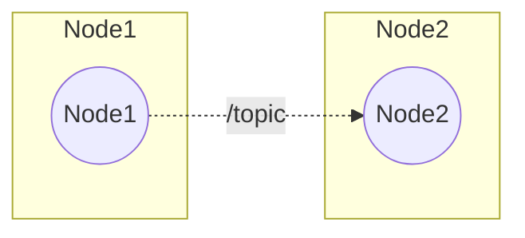

but what's really under the hood is more like:

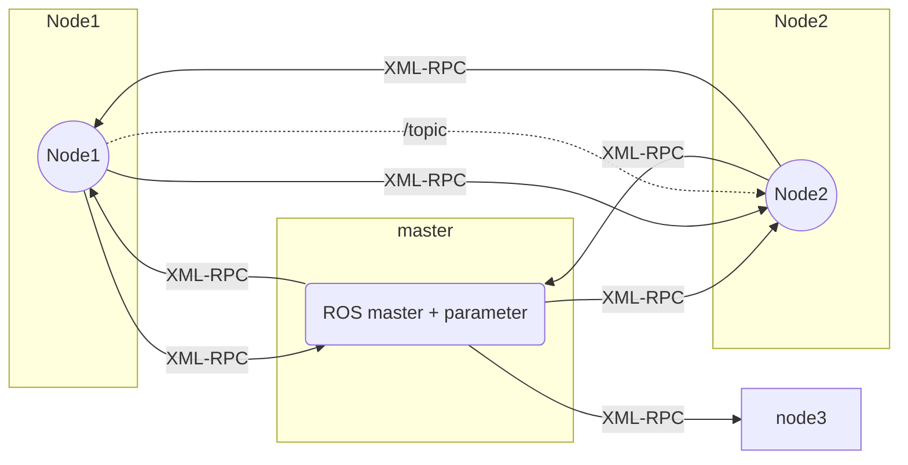

Now, the **data layer graph** however is most commonly as follows:

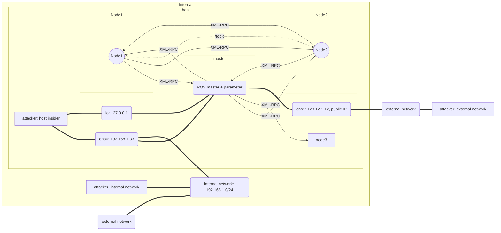

An attacker trying to obtain information about the robotic system would need to target the ROS master to perform reconnaissance. Given this **data layer graph** the following experiments come to mind from a reconnaissance point of view:

- `experiment 1`: Can a host insider attacker perform reconnaissance?
  - `passive`: Yes, sniff traffic.
  - `active`: Yes, subscribe to abstractions.
- `experiment 2`: Can an attacker in the internal network perform reconnaissance?
  - `passive`: No by default though, depends on the ROS configuration.
  - `active`: Yes, subscribe to abstractions. Or simply connect to ROS Master remotely.
- `experiment 3`: Can an attacker with access to an external network from where the ROS master  is addressable (through a public IP or alternatives) perform reconnaissance?
  - `passive`: No by default though, depends on the ROS configuration.
  - `actively`: Yes, subscribe to abstractions. Or simply connect to ROS Master remotely.

#### ROS 2 computational graph and data layer graph

For ROS 2 systems the **computational graph** aims to remain the same but the internal structure differes strongly:

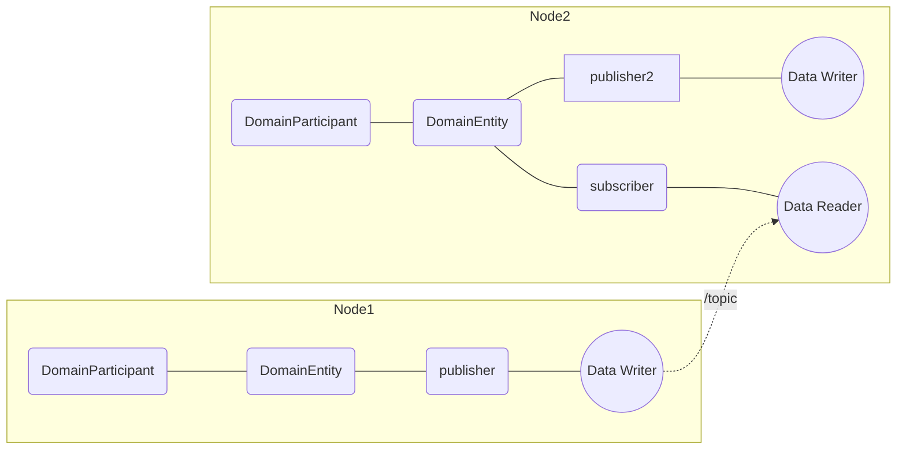

in ROS 2 the **data layer graph** is much more flexible and present different options:

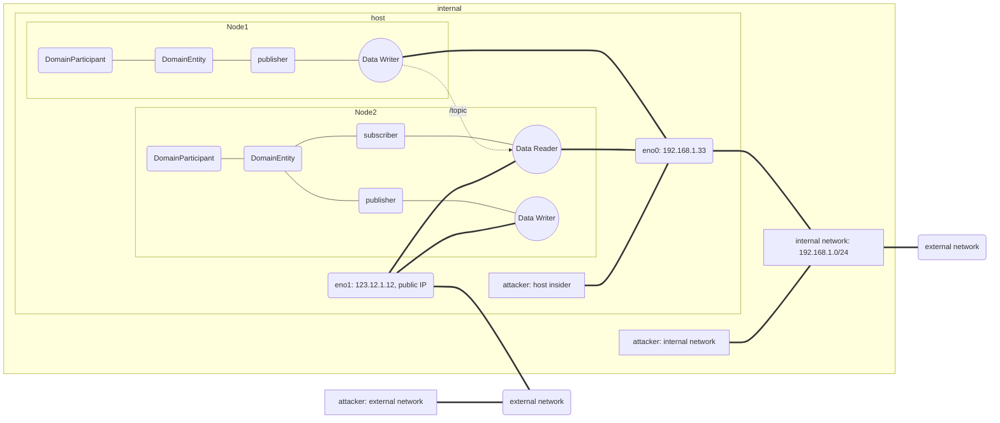

Question that arises here is, given the nature of DDS, can we consider the external network attacker as a threat to obtain information about the **computational graph**? 

Moreover, DDS provides flexibility for different architectures. Let's consideer a different **data layer graph**:


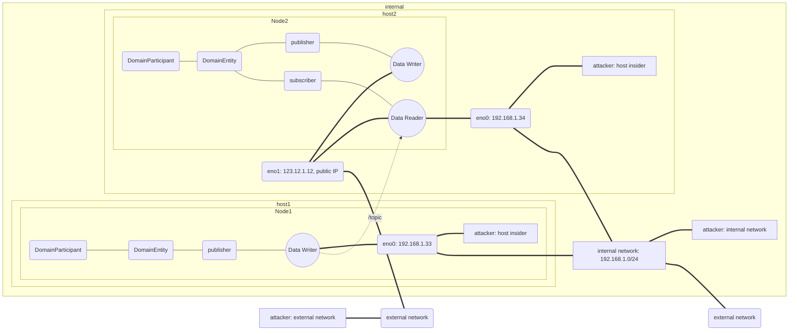

Finally and for completeness, let's consider yet another scenario described by the following diagram:

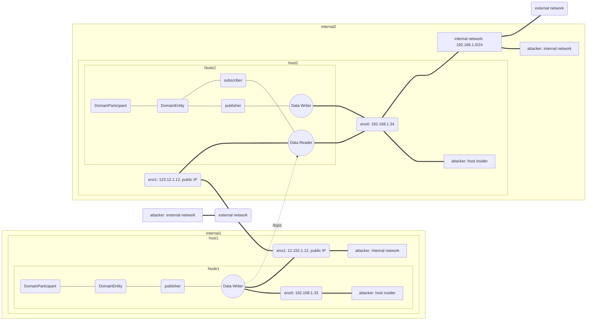


Provided this final **data layer graph** the following experiments come to mind from a reconnaissance point of view:

- `experiment 4`: Can a host insider attacker perform reconnaissance?
  - `passive`: Yes, sniff traffic.
  - `active`: Yes, subscribe to abstractions.
- `experiment 5`: Can an attacker in the internal network perform reconnaissance?
  - `passive`: Yes, sniff traffic.
  - `active`: Yes, subscribe to abstractions.
- `experiment 6`: Can an attacker with access to an external network from where the ROS master  is addressable (through a public IP or alternatives) perform reconnaissance?
  - `passive`: *Yes*, sniff traffic (requires multicast enabled across the networking path).
  - `actively`: Yes, subscribe to abstractions.

This leads to the following summary tables:

| ROS | Passive Reconnaissance | Active Reconnaissance |
|-----|------------------------|-----------------------|
|host insider | Yes  | Yes |
|internal network   | No*  | Yes |
|external network   |  No* | Yes |

| ROS 2 | Passive Reconnaissance | Active Reconnaissance |
|-----|------------------------|-----------------------|
|host insider | Yes  |  Yes |
|internal network   |  Yes | Yes |
|external network   | Yes*  | Yes? |


#### A review of ros command line tools for introspection
TODO

### Basic reconnaissance in ROS 2

Let's use aztarna for proper reconnaissance. In a local machine running Ubuntu 16.04 and where dashing has been installed from deb. files:

```bash
~/Alias/aztarna$ aztarna -t ROS2
Exploring ROS_DOMAIN_ID from: 0 to 5
Exploring ROS_DOMAIN_ID: 0
Exploring ROS_DOMAIN_ID: 1
Exploring ROS_DOMAIN_ID: 2
Exploring ROS_DOMAIN_ID: 3
...
```

This can take quite a bit of time (approximately 1 second per domain). Let's instead focus on the default DOMAIN ID (0):

```bash
aztarna -t ROS2 -d 0
Exploring ROS_DOMAIN_ID: 0
```

No response, as expected. Let's now launch some local ROS nodes and see the behavior:
```bash
# in another Terminal (terminal 1)
ros2 run demo_nodes_cpp listener

# in another Terminal (terminal 2)
ros2 run demo_nodes_cpp talker

# in another Terminal (terminal 3)
aztarna -t ROS2 -d 0
Exploring ROS_DOMAIN_ID: 0
[+] Host found in Domain ID 0
	Topics:
		Topic Name: /chatter 	|	 Topic Type: ['std_msgs/msg/String']
	Services:
		Service Name: /aztarna/describe_parameters |	 Service Type: ['rcl_interfaces/srv/DescribeParameters']
		Service Name: /aztarna/get_parameter_types |	 Service Type: ['rcl_interfaces/srv/GetParameterTypes']
		Service Name: /aztarna/get_parameters 	|	 Service Type: ['rcl_interfaces/srv/GetParameters']
		Service Name: /aztarna/list_parameters 	|	 Service Type: ['rcl_interfaces/srv/ListParameters']
		Service Name: /aztarna/set_parameters 	|	 Service Type: ['rcl_interfaces/srv/SetParameters']
		Service Name: /aztarna/set_parameters_atomically 	|	 Service Type: ['rcl_interfaces/srv/SetParametersAtomically']
		Service Name: /listener/describe_parameters 	|	 Service Type: ['rcl_interfaces/srv/DescribeParameters']
		Service Name: /listener/get_parameter_types 	|	 Service Type: ['rcl_interfaces/srv/GetParameterTypes']
		Service Name: /listener/get_parameters 	|	 Service Type: ['rcl_interfaces/srv/GetParameters']
		Service Name: /listener/list_parameters 	| Service Type: ['rcl_interfaces/srv/ListParameters']
		Service Name: /listener/set_parameters 	|	 Service Type: ['rcl_interfaces/srv/SetParameters']
		Service Name: /listener/set_parameters_atomically 	|	 Service Type: ['rcl_interfaces/srv/SetParametersAtomically']
		Service Name: /talker/describe_parameters | Service Type: ['rcl_interfaces/srv/DescribeParameters']
		Service Name: /talker/get_parameter_types | Service Type: ['rcl_interfaces/srv/GetParameterTypes']
		Service Name: /talker/get_parameters 	|	 Service Type: ['rcl_interfaces/srv/GetParameters']
		Service Name: /talker/list_parameters 	|	 Service Type: ['rcl_interfaces/srv/ListParameters']
		Service Name: /talker/set_parameters 	|	 Service Type: ['rcl_interfaces/srv/SetParameters']
		Service Name: /talker/set_parameters_atomically 	|	 Service Type: ['rcl_interfaces/srv/SetParametersAtomically']
	Nodes:
		Node Name: listener 	|	 Namespace: /
		Node Name: talker 	|	 Namespace: /
--------------------------------------------------------------------------------
```

If we stop ROS2 nodes, we see that `aztarna` also stops detecting things in the network.

One of the interesting features of `aztarna` is the fact that it inspects your system across all possible `ROS_DOMAIN_ID`s. Silly example with publisher and subscriber in two different DOMAIN IDs:

```bash
=> aztarna -t ROS2
[+] Host found in Domain ID 0
	Topics:
		Topic Name: /topic 	|	 Topic Type: ['std_msgs/msg/String']
	Services:
		Service Name: /aztarna/describe_parameters 	|	 Service Type: ['rcl_interfaces/srv/DescribeParameters']
		Service Name: /aztarna/get_parameter_types 	|	 Service Type: ['rcl_interfaces/srv/GetParameterTypes']
		Service Name: /aztarna/get_parameters 	|	 Service Type: ['rcl_interfaces/srv/GetParameters']
		Service Name: /aztarna/list_parameters 	|	 Service Type: ['rcl_interfaces/srv/ListParameters']
		Service Name: /aztarna/set_parameters 	|	 Service Type: ['rcl_interfaces/srv/SetParameters']
		Service Name: /aztarna/set_parameters_atomically 	|	 Service Type: ['rcl_interfaces/srv/SetParametersAtomically']
		Service Name: /minimal_publisher/describe_parameters 	|	 Service Type: ['rcl_interfaces/srv/DescribeParameters']
		Service Name: /minimal_publisher/get_parameter_types 	|	 Service Type: ['rcl_interfaces/srv/GetParameterTypes']
		Service Name: /minimal_publisher/get_parameters 	|	 Service Type: ['rcl_interfaces/srv/GetParameters']
		Service Name: /minimal_publisher/list_parameters 	|	 Service Type: ['rcl_interfaces/srv/ListParameters']
		Service Name: /minimal_publisher/set_parameters 	|	 Service Type: ['rcl_interfaces/srv/SetParameters']
		Service Name: /minimal_publisher/set_parameters_atomically 	|	 Service Type: ['rcl_interfaces/srv/SetParametersAtomically']
	Nodes:
		Node Name: _ros2cli_daemon_0 	|	 Namespace: /
		Node Name: minimal_publisher 	|	 Namespace: /
--------------------------------------------------------------------------------
[+] Host found in Domain ID 2
	Topics:
		Topic Name: /topic 	|	 Topic Type: ['std_msgs/msg/String']
	Services:
		Service Name: /aztarna/describe_parameters 	|	 Service Type: ['rcl_interfaces/srv/DescribeParameters']
		Service Name: /aztarna/get_parameter_types 	|	 Service Type: ['rcl_interfaces/srv/GetParameterTypes']
		Service Name: /aztarna/get_parameters 	|	 Service Type: ['rcl_interfaces/srv/GetParameters']
		Service Name: /aztarna/list_parameters 	|	 Service Type: ['rcl_interfaces/srv/ListParameters']
		Service Name: /aztarna/set_parameters 	|	 Service Type: ['rcl_interfaces/srv/SetParameters']
		Service Name: /aztarna/set_parameters_atomically 	|	 Service Type: ['rcl_interfaces/srv/SetParametersAtomically']
		Service Name: /minimal_subscriber/describe_parameters 	|	 Service Type: ['rcl_interfaces/srv/DescribeParameters']
		Service Name: /minimal_subscriber/get_parameter_types 	|	 Service Type: ['rcl_interfaces/srv/GetParameterTypes']
		Service Name: /minimal_subscriber/get_parameters 	|	 Service Type: ['rcl_interfaces/srv/GetParameters']
		Service Name: /minimal_subscriber/list_parameters 	|	 Service Type: ['rcl_interfaces/srv/ListParameters']
		Service Name: /minimal_subscriber/set_parameters 	|	 Service Type: ['rcl_interfaces/srv/SetParameters']
		Service Name: /minimal_subscriber/set_parameters_atomically 	|	 Service Type: ['rcl_interfaces/srv/SetParametersAtomically']
	Nodes:
		Node Name: minimal_subscriber 	|	 Namespace: /
--------------------------------------------------------------------------------
```

### More complex network architectures
Let's now try a different networking architecture and we'll use Docker to simulate everything:

```bash
# in Terminal (terminal 1)
docker run -it --net=host --rm osrf/ros2:nightly ros2 run demo_nodes_cpp listener
# in another Terminal (terminal 2)
docker run -it --net=host --rm osrf/ros2:nightly ros2 run demo_nodes_cpp talker
# in another Terminal (terminal 3)
devmachine:~/Alias/aztarna$ aztarna -t ROS2 -d 0
Exploring ROS_DOMAIN_ID: 0
[+] Host found in Domain ID 0
	Topics:
	Services:
		Service Name: /aztarna/describe_parameters |	 Service Type: ['rcl_interfaces/srv/DescribeParameters']
		Service Name: /aztarna/get_parameter_types |	 Service Type: ['rcl_interfaces/srv/GetParameterTypes']
		Service Name: /aztarna/get_parameters 	|	 Service Type: ['rcl_interfaces/srv/GetParameters']
		Service Name: /aztarna/list_parameters 	|	 Service Type: ['rcl_interfaces/srv/ListParameters']
		Service Name: /aztarna/set_parameters 	|	 Service Type: ['rcl_interfaces/srv/SetParameters']
		Service Name: /aztarna/set_parameters_atomically 	|	 Service Type: ['rcl_interfaces/srv/SetParametersAtomically']
		Service Name: /listener/describe_parameters 	|	 Service Type: ['rcl_interfaces/srv/DescribeParameters']
		Service Name: /listener/get_parameter_types 	|	 Service Type: ['rcl_interfaces/srv/GetParameterTypes']
		Service Name: /listener/get_parameters 	|	 Service Type: ['rcl_interfaces/srv/GetParameters']
		Service Name: /listener/list_parameters 	| Service Type: ['rcl_interfaces/srv/ListParameters']
		Service Name: /listener/set_parameters 	|	 Service Type: ['rcl_interfaces/srv/SetParameters']
		Service Name: /listener/set_parameters_atomically 	|	 Service Type: ['rcl_interfaces/srv/SetParametersAtomically']
	Nodes:
		Node Name: listener 	|	 Namespace: /
--------------------------------------------------------------------------------
devmachine:~/Alias/aztarna$ aztarna -t ROS2 -d 0
Exploring ROS_DOMAIN_ID: 0
^[[A[+] Host found in Domain ID 0
	Topics:
	Services:
		Service Name: /aztarna/describe_parameters |	 Service Type: ['rcl_interfaces/srv/DescribeParameters']
		Service Name: /aztarna/get_parameter_types |	 Service Type: ['rcl_interfaces/srv/GetParameterTypes']
		Service Name: /aztarna/get_parameters 	|	 Service Type: ['rcl_interfaces/srv/GetParameters']
		Service Name: /aztarna/list_parameters 	|	 Service Type: ['rcl_interfaces/srv/ListParameters']
		Service Name: /aztarna/set_parameters 	|	 Service Type: ['rcl_interfaces/srv/SetParameters']
		Service Name: /aztarna/set_parameters_atomically 	|	 Service Type: ['rcl_interfaces/srv/SetParametersAtomically']
		Service Name: /talker/describe_parameters | Service Type: ['rcl_interfaces/srv/DescribeParameters']
		Service Name: /talker/get_parameter_types | Service Type: ['rcl_interfaces/srv/GetParameterTypes']
		Service Name: /talker/get_parameters 	|	 Service Type: ['rcl_interfaces/srv/GetParameters']
		Service Name: /talker/list_parameters 	|	 Service Type: ['rcl_interfaces/srv/ListParameters']
		Service Name: /talker/set_parameters 	|	 Service Type: ['rcl_interfaces/srv/SetParameters']
		Service Name: /talker/set_parameters_atomically 	|	 Service Type: ['rcl_interfaces/srv/SetParametersAtomically']
	Nodes:
		Node Name: talker 	|	 Namespace: /
--------------------------------------------------------------------------------
```

There's some weird stuff going on clearly. We launched aztarna twice from the host machine and things seem to be not operating that nicely. Moreover `talker` and `listener` do not interoperate neither. Maybe because we're using `nightly` instead of `dashing` in the Docker containers. Let's see:

```bash
# in Terminal (terminal 1)
docker run -it --net=host --rm ros:dashing
apt-get update; apt-get install ros-dashing-demo-nodes-cpp -y
ros2 run demo_nodes_cpp talker

# in another Terminal (terminal 2)
docker run -it --net=host --rm ros:dashing
apt-get update; apt-get install ros-dashing-demo-nodes-cpp -y
ros2 run demo_nodes_cpp listener


# in another Terminal (terminal 3)
devmachine:~/Alias/aztarna$ aztarna -t ROS2 -d 0
...
```

Same behavior. All of this was set up in the same machine. It's clearly not the ROS 2 image and there's no interoperability while they both use the default ROS DOMAIN ID. 

Lets use `macvlan` driver and create containers that are directly connected to the physical network. Let's assign to Docker the subset `192.168.1.192/27`, which is a range of 32 address starting at `192.168.1.192` and ending at `192.168.1.223`.

```bash
# in Terminal (terminal 1)
docker network create -d macvlan \
  --subnet=192.168.1.0/24 \
  --gateway=192.168.1.1 \
	--ip-range 192.168.1.192/27 \
  -o parent=eno1 \
  ros2net

devmachine:~/Alias/aztarna$ docker network list
NETWORK ID          NAME                DRIVER              SCOPE
13fb33779f05        bridge              bridge              local
8c298e85da72        host                host                local
4bd08482ee49        none                null                local
7f792ae86403        ros2net             macvlan             local

# in another Terminal (terminal 2)
docker run -it --rm --network ros2net --name ros2listener osrf/ros2:nightly ros2 run demo_nodes_cpp listener

# in Terminal (terminal 1)
devmachine:~/Alias/aztarna$ docker container inspect ros2listener
[
    {
        "Id": "9fd0b280f48215d9851d4e3026279c231790ef979e2c0c8b15766369b4bd2f2b",
        "Created": "2019-10-12T09:32:00.783071238Z",
        "Path": "/ros_entrypoint.sh",
        "Args": [
            "ros2",
            "run",
            "demo_nodes_cpp",
            "listener"
...
        "NetworkSettings": {
            "Bridge": "",
            "SandboxID": "f37a10d810e912cadb740a81ee8a57684b8f2fd38a03a07befbacc27e9101500",
            "HairpinMode": false,
            "LinkLocalIPv6Address": "",
            "LinkLocalIPv6PrefixLen": 0,
            "Ports": {},
            "SandboxKey": "/var/run/docker/netns/f37a10d810e9",
            "SecondaryIPAddresses": null,
            "SecondaryIPv6Addresses": null,
            "EndpointID": "",
            "Gateway": "",
            "GlobalIPv6Address": "",
            "GlobalIPv6PrefixLen": 0,
            "IPAddress": "",
            "IPPrefixLen": 0,
            "IPv6Gateway": "",
            "MacAddress": "",
            "Networks": {
                "ros2net": {
                    "IPAMConfig": null,
                    "Links": null,
                    "Aliases": [
                        "9fd0b280f482"
                    ],
                    "NetworkID": "7f792ae86403e9fcd56f961a7757d01e7bebbf07b869c2f239dc9cb1edc4d4db",
                    "EndpointID": "dab57675e5b5c116dde00550c4f60fd11fd957a740c4f046553f92c5f4fbad0c",
                    "Gateway": "192.168.1.1",
                    "IPAddress": "192.168.1.192",
                    "IPPrefixLen": 24,
                    "IPv6Gateway": "",
                    "GlobalIPv6Address": "",
                    "GlobalIPv6PrefixLen": 0,
                    "MacAddress": "02:42:c0:a8:01:c0",
                    "DriverOpts": null
                }
            }
        }
    }
]


devmachine:~/Alias/aztarna$ docker exec ros2listener /bin/bash -c "apt-get update ; apt-get install net-tools -y; ifconfig eth0"
...
eth0: flags=4163<UP,BROADCAST,RUNNING,MULTICAST>  mtu 1500
        inet 192.168.1.192  netmask 255.255.255.0  broadcast 192.168.1.255
        ether 02:42:c0:a8:01:c0  txqueuelen 0  (Ethernet)
        RX packets 3365  bytes 18116070 (18.1 MB)
        RX errors 0  dropped 5  overruns 0  frame 0
        TX packets 3365  bytes 321254 (321.2 KB)
        TX errors 0  dropped 0 overruns 0  carrier 0  collisions 0

devmachine:~/Alias/aztarna$ aztarna -t ROS2 -d 0
Exploring ROS_DOMAIN_ID: 0
```

So far, we have created a docker network and launched a listener within that network that has multicast enabled. If we try to launch now aztarna:

```bash
# in Terminal (terminal 1)
devmachine:~/Alias/aztarna$ aztarna -t ROS2 -d 0
Exploring ROS_DOMAIN_ID: 0
```

It does not find anything. This is somehow covered at [3] where it explains how to launch things appropriately for interoperability within the newly created docker network. Another approach is simply to launch aztarna within the docker network and introspect it that way. Lets proceed this path. 

```bash
# in Terminal (terminal 1)
devmachine:~/Alias/aztarna$ docker build -t aztarna_docker .
devmachine:~/Alias/aztarna$ docker run -it --rm --network ros2net --name ros2aztarna aztarna_docker -t ROS2 -d 0
[connext_cmake_module] Warning: The location at which Connext was found when the workspace was built [[/opt/rti.com/rti_connext_dds-5.3.1]] does not point to a valid directory, and the NDDSHOME environment variable has not been set. Support for Connext will not be available.
Exploring ROS_DOMAIN_ID: 0
[+] Host found in Domain ID 0
	Topics:
		Topic Name: /chatter 	|	 Topic Type: ['std_msgs/msg/String']
	Services:
		Service Name: /aztarna/describe_parameters |	 Service Type: ['rcl_interfaces/srv/DescribeParameters']
		Service Name: /aztarna/get_parameter_types |	 Service Type: ['rcl_interfaces/srv/GetParameterTypes']
		Service Name: /aztarna/get_parameters 	|	 Service Type: ['rcl_interfaces/srv/GetParameters']
		Service Name: /aztarna/list_parameters 	|	 Service Type: ['rcl_interfaces/srv/ListParameters']
		Service Name: /aztarna/set_parameters 	|	 Service Type: ['rcl_interfaces/srv/SetParameters']
		Service Name: /aztarna/set_parameters_atomically 	|	 Service Type: ['rcl_interfaces/srv/SetParametersAtomically']
		Service Name: /listener/describe_parameters 	|	 Service Type: ['rcl_interfaces/srv/DescribeParameters']
		Service Name: /listener/get_parameter_types 	|	 Service Type: ['rcl_interfaces/srv/GetParameterTypes']
		Service Name: /listener/get_parameters 	|	 Service Type: ['rcl_interfaces/srv/GetParameters']
		Service Name: /listener/list_parameters 	| Service Type: ['rcl_interfaces/srv/ListParameters']
		Service Name: /listener/set_parameters 	|	 Service Type: ['rcl_interfaces/srv/SetParameters']
		Service Name: /listener/set_parameters_atomically 	|	 Service Type: ['rcl_interfaces/srv/SetParametersAtomically']
	Nodes:
		Node Name: listener 	|	 Namespace: /
--------------------------------------------------------------------------------
```

That's it! Let's now launch a talker as well (using the previously created docker network `ros2net`):

```bash
# in Terminal (terminal 2)
docker run -it --rm --network ros2net --name ros2listener osrf/ros2:nightly ros2 run demo_nodes_cpp listener

# in another Terminal (terminal 3)
docker run -it --rm --network ros2net --name ros2talker osrf/ros2:nightly ros2 run demo_nodes_cpp talker

# in Terminal (terminal 1)
devmachine:~/Alias/aztarna$ docker run -it --rm --network ros2net --name ros2aztarna aztarna_docker -t ROS2 -d 0
[connext_cmake_module] Warning: The location at which Connext was found when the workspace was built [[/opt/rti.com/rti_connext_dds-5.3.1]] does not point to a valid directory, and the NDDSHOME environment variable has not been set. Support for Connext will not be available.
Exploring ROS_DOMAIN_ID: 0
[+] Host found in Domain ID 0
	Topics:
		Topic Name: /chatter 	|	 Topic Type: ['std_msgs/msg/String']
	Services:
		Service Name: /aztarna/describe_parameters 	|	 Service Type: ['rcl_interfaces/srv/DescribeParameters']
		Service Name: /aztarna/get_parameter_types 	|	 Service Type: ['rcl_interfaces/srv/GetParameterTypes']
		Service Name: /aztarna/get_parameters 	|	 Service Type: ['rcl_interfaces/srv/GetParameters']
		Service Name: /aztarna/list_parameters 	|	 Service Type: ['rcl_interfaces/srv/ListParameters']
		Service Name: /aztarna/set_parameters 	|	 Service Type: ['rcl_interfaces/srv/SetParameters']
		Service Name: /aztarna/set_parameters_atomically 	|	 Service Type: ['rcl_interfaces/srv/SetParametersAtomically']
		Service Name: /listener/describe_parameters 	|	 Service Type: ['rcl_interfaces/srv/DescribeParameters']
		Service Name: /listener/get_parameter_types 	|	 Service Type: ['rcl_interfaces/srv/GetParameterTypes']
		Service Name: /listener/get_parameters 	|	 Service Type: ['rcl_interfaces/srv/GetParameters']
		Service Name: /listener/list_parameters 	|	 Service Type: ['rcl_interfaces/srv/ListParameters']
		Service Name: /listener/set_parameters 	|	 Service Type: ['rcl_interfaces/srv/SetParameters']
		Service Name: /listener/set_parameters_atomically 	|	 Service Type: ['rcl_interfaces/srv/SetParametersAtomically']
		Service Name: /talker/describe_parameters 	|	 Service Type: ['rcl_interfaces/srv/DescribeParameters']
		Service Name: /talker/get_parameter_types 	|	 Service Type: ['rcl_interfaces/srv/GetParameterTypes']
		Service Name: /talker/get_parameters 	|	 Service Type: ['rcl_interfaces/srv/GetParameters']
		Service Name: /talker/list_parameters 	|	 Service Type: ['rcl_interfaces/srv/ListParameters']
		Service Name: /talker/set_parameters 	|	 Service Type: ['rcl_interfaces/srv/SetParameters']
		Service Name: /talker/set_parameters_atomically 	|	 Service Type: ['rcl_interfaces/srv/SetParametersAtomically']
	Nodes:
		Node Name: listener 	|	 Namespace: /
		Node Name: talker 	|	 Namespace: /
--------------------------------------------------------------------------------
```


We can now of course see interoperability across ROS 2 nodes and `aztarna` detects things appropriately. One thing noticed while experimenting is that the order of launching the containers matters quite a lot and aztarna doesnt seem to respond coherently since it appear it misses some topics.

```bash
devmachine:~/Alias/aztarna$ docker run -it --rm --network ros2net --name ros2aztarna aztarna_docker -t ROS2 -d 0
[connext_cmake_module] Warning: The location at which Connext was found when the workspace was built [[/opt/rti.com/rti_connext_dds-5.3.1]] does not point to a valid directory, and the NDDSHOME environment variable has not been set. Support for Connext will not be available.
Exploring ROS_DOMAIN_ID: 0
[+] Host found in Domain ID 0
	Topics:
	Services:
		Service Name: /aztarna/describe_parameters 	|	 Service Type: ['rcl_interfaces/srv/DescribeParameters']
		Service Name: /aztarna/get_parameter_types 	|	 Service Type: ['rcl_interfaces/srv/GetParameterTypes']
		Service Name: /aztarna/get_parameters 	|	 Service Type: ['rcl_interfaces/srv/GetParameters']
		Service Name: /aztarna/list_parameters 	|	 Service Type: ['rcl_interfaces/srv/ListParameters']
		Service Name: /aztarna/set_parameters 	|	 Service Type: ['rcl_interfaces/srv/SetParameters']
		Service Name: /aztarna/set_parameters_atomically 	|	 Service Type: ['rcl_interfaces/srv/SetParametersAtomically']
	Nodes:
		Node Name: talker 	|	 Namespace: /
--------------------------------------------------------------------------------
devmachine:~/Alias/aztarna$ docker run -it --rm --network ros2net --name ros2aztarna aztarna_docker -t ROS2 -d 0
[connext_cmake_module] Warning: The location at which Connext was found when the workspace was built [[/opt/rti.com/rti_connext_dds-5.3.1]] does not point to a valid directory, and the NDDSHOME environment variable has not been set. Support for Connext will not be available.
Exploring ROS_DOMAIN_ID: 0
[+] Host found in Domain ID 0
	Topics:
	Services:
		Service Name: /aztarna/describe_parameters 	|	 Service Type: ['rcl_interfaces/srv/DescribeParameters']
		Service Name: /aztarna/get_parameter_types 	|	 Service Type: ['rcl_interfaces/srv/GetParameterTypes']
		Service Name: /aztarna/get_parameters 	|	 Service Type: ['rcl_interfaces/srv/GetParameters']
		Service Name: /aztarna/list_parameters 	|	 Service Type: ['rcl_interfaces/srv/ListParameters']
		Service Name: /aztarna/set_parameters 	|	 Service Type: ['rcl_interfaces/srv/SetParameters']
		Service Name: /aztarna/set_parameters_atomically 	|	 Service Type: ['rcl_interfaces/srv/SetParametersAtomically']
	Nodes:
		Node Name: listener 	|	 Namespace: /
--------------------------------------------------------------------------------
devmachine:~/Alias/aztarna$ docker run -it --rm --network ros2net --name ros2aztarna aztarna_docker -t ROS2 -d 0
[connext_cmake_module] Warning: The location at which Connext was found when the workspace was built [[/opt/rti.com/rti_connext_dds-5.3.1]] does not point to a valid directory, and the NDDSHOME environment variable has not been set. Support for Connext will not be available.
Exploring ROS_DOMAIN_ID: 0
[+] Host found in Domain ID 0
	Topics:
	Services:
		Service Name: /aztarna/describe_parameters 	|	 Service Type: ['rcl_interfaces/srv/DescribeParameters']
		Service Name: /aztarna/get_parameter_types 	|	 Service Type: ['rcl_interfaces/srv/GetParameterTypes']
		Service Name: /aztarna/get_parameters 	|	 Service Type: ['rcl_interfaces/srv/GetParameters']
		Service Name: /aztarna/list_parameters 	|	 Service Type: ['rcl_interfaces/srv/ListParameters']
		Service Name: /aztarna/set_parameters 	|	 Service Type: ['rcl_interfaces/srv/SetParameters']
		Service Name: /aztarna/set_parameters_atomically 	|	 Service Type: ['rcl_interfaces/srv/SetParametersAtomically']
	Nodes:
		Node Name: listener 	|	 Namespace: /
--------------------------------------------------------------------------------
```

This is somewhat concerning and needs to be debugged.
Finally, lets cleanup:

```bash
docker container stop ros2listener # and any other container we launched
docker network rm ros2net
```

Before jumping into debugging these problems with `aztarna` and improve the way it fetches information, lets get an multi-network architecture set up

### multi-host VXLAN and more

#### A review of docker basic networking modes
Three kind of networks in docker by default:
- `bridge`: associated to the `docker0` networking interface (which appears clearly in Linux installations). Default. Container connect to this network automatically which has a gateway also by default.
- `none`:  only has a local loopback interface (i.e., no external network interface).
- `host`:  enables a container to attach to your host’s network (meaning the configuration inside the container matches the configuration outside the container).

#### Defining your own networks with docker

You can create multiple networks with Docker and add containers to one or more networks. Containers can communicate within networks but **not across networks** (abstract networks). ~~This is certainly a limitation that needs to be taken into account~~. 

There are fine types of network drivers that you can use when creating networks. Skipping `host` and `None` explained above, the sections below discuss them in more detail:

##### bridge network driver
Thought for use within a single host. The bridge driver creates a private network internal to the host so containers on this network can communicate. External access is granted by exposing ports to containers. Docker secures the network by managing rules that block connectivity between different Docker networks.

In the example highlighted below, a Docker bridge network is created and two containers are attached to it. With no extra configuration the Docker Engine does the necessary wiring, provides service discovery for the containers, and configures security rules to prevent communication to other networks. A built-in IPAM driver provides the container interfaces with private IP addresses from the subnet of the bridge network.

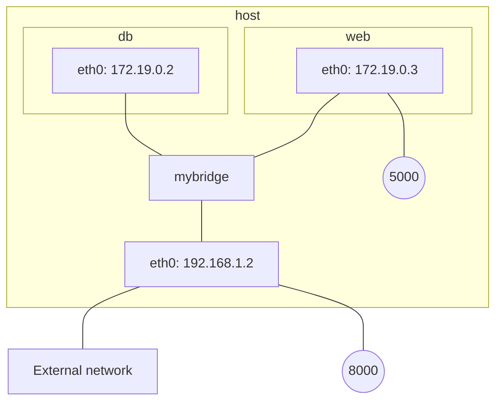

```bash
docker network create -d bridge mybridge
docker run -d --net mybridge --name db redis 
docker run -d --net mybridge -e DB=db -p 8000:5000 --name web chrch/web
```

Introspecting the container and its network configuration:
```bash
docker container inspect web
...
"NetworkSettings": {
     "Bridge": "",
     "SandboxID": "c59ef4b17c485e46ef7e52163f992a6e17c46326def1a0190e9b2fd9662efa32",
     "HairpinMode": false,
     "LinkLocalIPv6Address": "",
     "LinkLocalIPv6PrefixLen": 0,
     "Ports": {
         "5000/tcp": [
             {
                 "HostIp": "0.0.0.0",
                 "HostPort": "8000"
             }
         ]
     },
     "SandboxKey": "/var/run/docker/netns/c59ef4b17c48",
     "SecondaryIPAddresses": null,
     "SecondaryIPv6Addresses": null,
     "EndpointID": "",
     "Gateway": "",
     "GlobalIPv6Address": "",
     "GlobalIPv6PrefixLen": 0,
     "IPAddress": "",
     "IPPrefixLen": 0,
     "IPv6Gateway": "",
     "MacAddress": "",
     "Networks": {
         "mybridge": {
             "IPAMConfig": null,
             "Links": null,
             "Aliases": [
                 "e88972e14330"
             ],
             "NetworkID": "255e94dcfbe550fbde74465edf94a3219ab4007cfe62cc7ba66361982ad76f1b",
             "EndpointID": "530e3b88892b32e51efc2b4d0bd801d0b452dd942e257b63ccccb83007e383f0",
             "Gateway": "172.19.0.1",
             "IPAddress": "172.19.0.3",
             "IPPrefixLen": 16,
             "IPv6Gateway": "",
             "GlobalIPv6Address": "",
             "GlobalIPv6PrefixLen": 0,
             "MacAddress": "02:42:ac:13:00:03",
             "DriverOpts": null
         }
     }
 }
            
docker exec web ifconfig
eth0      Link encap:Ethernet  HWaddr 02:42:AC:13:00:03
          inet addr:172.19.0.3  Bcast:172.19.255.255  Mask:255.255.0.0
          UP BROADCAST RUNNING MULTICAST  MTU:1500  Metric:1
          RX packets:18 errors:0 dropped:0 overruns:0 frame:0
          TX packets:3 errors:0 dropped:0 overruns:0 carrier:0
          collisions:0 txqueuelen:0
          RX bytes:1276 (1.2 KiB)  TX bytes:158 (158.0 B)

lo        Link encap:Local Loopback
          inet addr:127.0.0.1  Mask:255.0.0.0
          UP LOOPBACK RUNNING  MTU:65536  Metric:1
          RX packets:16 errors:0 dropped:0 overruns:0 frame:0
          TX packets:16 errors:0 dropped:0 overruns:0 carrier:0
          collisions:0 txqueuelen:1
          RX bytes:814 (814.0 B)  TX bytes:814 (814.0 B)
```

With this configuration, I can't see anything from outside whereas without creating a bridge:

```bash
docker run -d --name db redis 
docker run -d -e DB=db -p 8000:5000 --name web chrch/web
docker container inspect web
"NetworkSettings": {
           "Bridge": "",
           "SandboxID": "df36c1441d96bc0fc275e758c941c8ca6cfcc1a8b84421e36d794083ab8bd1da",
           "HairpinMode": false,
           "LinkLocalIPv6Address": "",
           "LinkLocalIPv6PrefixLen": 0,
           "Ports": {
               "5000/tcp": [
                   {
                       "HostIp": "0.0.0.0",
                       "HostPort": "8000"
                   }
               ]
           },
           "SandboxKey": "/var/run/docker/netns/df36c1441d96",
           "SecondaryIPAddresses": null,
           "SecondaryIPv6Addresses": null,
           "EndpointID": "1083522a449e051c05a4e362bbf4e4f5d41e12117564e289b7e5521beebacb7d",
           "Gateway": "172.17.0.1",
           "GlobalIPv6Address": "",
           "GlobalIPv6PrefixLen": 0,
           "IPAddress": "172.17.0.2",
           "IPPrefixLen": 16,
           "IPv6Gateway": "",
           "MacAddress": "02:42:ac:11:00:02",
           "Networks": {
               "bridge": {
                   "IPAMConfig": null,
                   "Links": null,
                   "Aliases": null,
                   "NetworkID": "70b4053a482e8cda17a25ce29b87b07f626164a71bea61c90d11b739757021f5",
                   "EndpointID": "1083522a449e051c05a4e362bbf4e4f5d41e12117564e289b7e5521beebacb7d",
                   "Gateway": "172.17.0.1",
                   "IPAddress": "172.17.0.2",
                   "IPPrefixLen": 16,
                   "IPv6Gateway": "",
                   "GlobalIPv6Address": "",
                   "GlobalIPv6PrefixLen": 0,
                   "MacAddress": "02:42:ac:11:00:02",
                   "DriverOpts": null
               }
           }
       }
    
docker exec web ifconfig
eth0      Link encap:Ethernet  HWaddr 02:42:AC:11:00:02
          inet addr:172.17.0.2  Bcast:172.17.255.255  Mask:255.255.0.0
          UP BROADCAST RUNNING MULTICAST  MTU:1500  Metric:1
          RX packets:13 errors:0 dropped:0 overruns:0 frame:0
          TX packets:3 errors:0 dropped:0 overruns:0 carrier:0
          collisions:0 txqueuelen:0
          RX bytes:974 (974.0 B)  TX bytes:146 (146.0 B)

lo        Link encap:Local Loopback
          inet addr:127.0.0.1  Mask:255.0.0.0
          UP LOOPBACK RUNNING  MTU:65536  Metric:1
          RX packets:0 errors:0 dropped:0 overruns:0 frame:0
          TX packets:0 errors:0 dropped:0 overruns:0 carrier:0
          collisions:0 txqueuelen:1
          RX bytes:0 (0.0 B)  TX bytes:0 (0.0 B)    

```

Weird, the example worked once without the bridge and **then it didn't work**.
Likely because an issue with the example. Trying a different architecture without the db which seems to be troublesome.


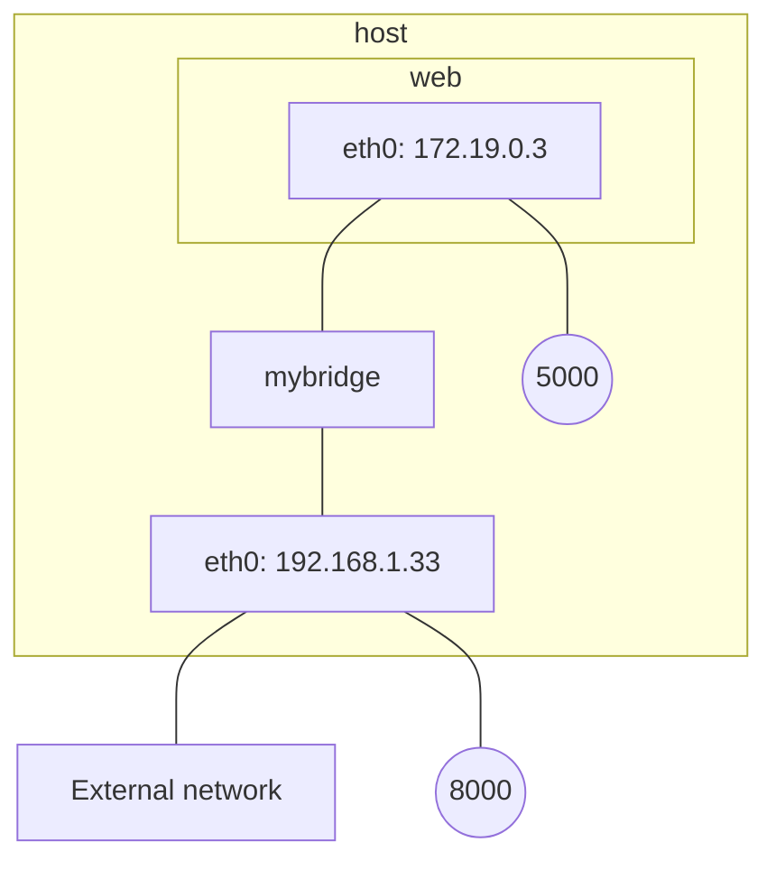


```bash
# docker run -d --name db redis
docker run -it --rm -p 8000:5000 --name web chrch/web
```

This worked! DB seems to cause issues, removing it does it. Lets now see the bridge driver.

```bash
docker network create -d bridge mybridge
# docker run -d --net mybridge --name db redis
docker run -it --rm --net mybridge -p 8000:5000 --name web chrch/web
```

Works within the samee machine (host) as well as within the local network.

##### overlay network driver
Multi-host service discovery requires an external solution that can map containers to their host location. This is exactly what makes the overlay driver so great.

The built-in Docker overlay network driver radically simplifies many of the complexities in multi-host networking. It is a swarm scope driver, which means that it operates across an entire Swarm or UCP cluster rather than individual hosts. With the overlay driver, multi-host networks are first-class citizens inside Docker without external provisioning or components.

The overlay driver utilizes an industry-standard VXLAN data plane that decouples the container network from the underlying physical network (the underlay). This has the advantage of providing maximum portability across various cloud and on-premises networks.

Read [8] and [13] for more.

##### macvlan network driver

The macvlan driver is the newest built-in network driver and offers several unique characteristics. It’s a very lightweight driver, because rather than using any Linux bridging or port mapping, it connects container interfaces directly to host interfaces. Containers are addressed with routable IP addresses that are on the subnet of the external network.

**macvlan is a local scope network driver which is configured per-host.** As a result, there are stricter dependencies between MACVLAN and external networks, which is both a constraint and an advantage that is different from overlay or bridge.

Read [8] and [13] for more.

### Setup for evaluation of footprinting

#### Using the MACVLAN docker networking driver

Objective is to obtain a configuration like what follows:

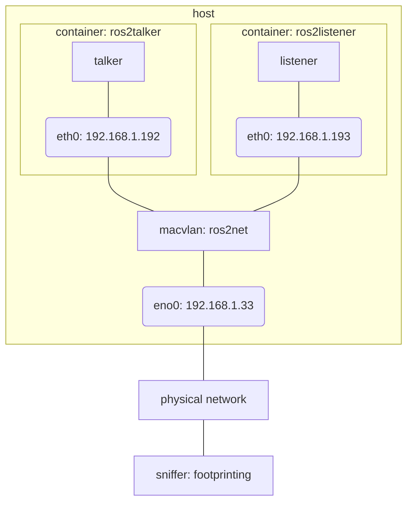

Lets use macvlan driver and create containers that are directly connected to the physical network. Let's assign to Docker the subset `192.168.1.192/27`, which is a range of 32 addresses starting at `192.168.1.192` and ending at `192.168.1.223`.

```bash
# in Terminal (terminal 1)
docker network create -d macvlan \
  --subnet=192.168.1.0/24 \
  --gateway=192.168.1.1 \
	--ip-range 192.168.1.192/27 \
  -o parent=eno1 \
  ros2net

# in another Terminal (terminal 2)
docker run -it --rm --network ros2net --name ros2listener osrf/ros2:nightly ros2 run demo_nodes_cpp listener

# in another Terminal (terminal 3)
docker run -it --rm --network ros2net --name ros2talker osrf/ros2:nightly ros2 run demo_nodes_cpp talker

# in Terminal (terminal 1)
docker run -it --rm --network ros2net --name ros2aztarna aztarna_docker -t ROS2 -d 0
docker run -it --rm --network ros2net --name ros2aztarna aztarna_docker -t ROS2 -d 0
[connext_cmake_module] Warning: The location at which Connext was found when the workspace was built [[/opt/rti.com/rti_connext_dds-5.3.1]] does not point to a valid directory, and the NDDSHOME environment variable has not been set. Support for Connext will not be available.
Exploring ROS_DOMAIN_ID: 0
[+] Host found in Domain ID 0
	Topics:
		Topic Name: /chatter 	|	 Topic Type: ['std_msgs/msg/String']
	Services:
		Service Name: /aztarna/describe_parameters 	|	 Service Type: ['rcl_interfaces/srv/DescribeParameters']
		Service Name: /aztarna/get_parameter_types 	|	 Service Type: ['rcl_interfaces/srv/GetParameterTypes']
		Service Name: /aztarna/get_parameters 	|	 Service Type: ['rcl_interfaces/srv/GetParameters']
		Service Name: /aztarna/list_parameters 	|	 Service Type: ['rcl_interfaces/srv/ListParameters']
		Service Name: /aztarna/set_parameters 	|	 Service Type: ['rcl_interfaces/srv/SetParameters']
		Service Name: /aztarna/set_parameters_atomically 	|	 Service Type: ['rcl_interfaces/srv/SetParametersAtomically']
		Service Name: /listener/describe_parameters 	|	 Service Type: ['rcl_interfaces/srv/DescribeParameters']
		Service Name: /listener/get_parameter_types 	|	 Service Type: ['rcl_interfaces/srv/GetParameterTypes']
		Service Name: /listener/get_parameters 	|	 Service Type: ['rcl_interfaces/srv/GetParameters']
		Service Name: /listener/list_parameters 	|	 Service Type: ['rcl_interfaces/srv/ListParameters']
		Service Name: /listener/set_parameters 	|	 Service Type: ['rcl_interfaces/srv/SetParameters']
		Service Name: /listener/set_parameters_atomically 	|	 Service Type: ['rcl_interfaces/srv/SetParametersAtomically']
		Service Name: /talker/describe_parameters 	|	 Service Type: ['rcl_interfaces/srv/DescribeParameters']
		Service Name: /talker/get_parameter_types 	|	 Service Type: ['rcl_interfaces/srv/GetParameterTypes']
		Service Name: /talker/get_parameters 	|	 Service Type: ['rcl_interfaces/srv/GetParameters']
		Service Name: /talker/list_parameters 	|	 Service Type: ['rcl_interfaces/srv/ListParameters']
		Service Name: /talker/set_parameters 	|	 Service Type: ['rcl_interfaces/srv/SetParameters']
		Service Name: /talker/set_parameters_atomically 	|	 Service Type: ['rcl_interfaces/srv/SetParametersAtomically']
	Nodes:
		Node Name: listener 	|	 Namespace: /
		Node Name: talker 	|	 Namespace: /
--------------------------------------------------------------------------------
```

There a few things that will be improved upon the upcoming iterations:
- Non-intrusive Footprinting
- Improved acquisition of information by making better use of rclpy 

Let's inspect the `ros2net`:

```bash
devmachine:~/Alias/aztarna$ docker container inspect ros2listener

docker container inspect ros2listener
...
        "NetworkSettings": {
            "Bridge": "",
            "SandboxID": "9681e881dae2d91f307d1e8536a0ae915e9e483cda1b9a07f1bfdfd596cbb90e",
            "HairpinMode": false,
            "LinkLocalIPv6Address": "",
            "LinkLocalIPv6PrefixLen": 0,
            "Ports": {},
            "SandboxKey": "/var/run/docker/netns/9681e881dae2",
            "SecondaryIPAddresses": null,
            "SecondaryIPv6Addresses": null,
            "EndpointID": "",
            "Gateway": "",
            "GlobalIPv6Address": "",
            "GlobalIPv6PrefixLen": 0,
            "IPAddress": "",
            "IPPrefixLen": 0,
            "IPv6Gateway": "",
            "MacAddress": "",
            "Networks": {
                "ros2net": {
                    "IPAMConfig": null,
                    "Links": null,
                    "Aliases": [
                        "416973a073b7"
                    ],
                    "NetworkID": "891b9a37eb42e0f87bec2559d135f2ce5ed1c1540abf8ac0cd24f7279a6a1c69",
                    "EndpointID": "636e16c22db69de2a63ab75d079f6f0059bbfe4997bf9ccaa0970cc7dc35fcaf",
                    "Gateway": "192.168.1.1",
                    "IPAddress": "192.168.1.192",
                    "IPPrefixLen": 24,
                    "IPv6Gateway": "",
                    "GlobalIPv6Address": "",
                    "GlobalIPv6PrefixLen": 0,
                    "MacAddress": "02:42:c0:a8:01:c0",
                    "DriverOpts": null
                }
            }
        }
    }
]


docker container inspect ros2talker
...
        "NetworkSettings": {
            "Bridge": "",
            "SandboxID": "712b02de40dab34f2dcb45ac6a007d5a68e3215a2c601190dfd0e69c124e7242",
            "HairpinMode": false,
            "LinkLocalIPv6Address": "",
            "LinkLocalIPv6PrefixLen": 0,
            "Ports": {},
            "SandboxKey": "/var/run/docker/netns/712b02de40da",
            "SecondaryIPAddresses": null,
            "SecondaryIPv6Addresses": null,
            "EndpointID": "",
            "Gateway": "",
            "GlobalIPv6Address": "",
            "GlobalIPv6PrefixLen": 0,
            "IPAddress": "",
            "IPPrefixLen": 0,
            "IPv6Gateway": "",
            "MacAddress": "",
            "Networks": {
                "ros2net": {
                    "IPAMConfig": null,
                    "Links": null,
                    "Aliases": [
                        "cd9672378bbb"
                    ],
                    "NetworkID": "891b9a37eb42e0f87bec2559d135f2ce5ed1c1540abf8ac0cd24f7279a6a1c69",
                    "EndpointID": "65f3b7c267ade984106355a8e8f9052c58131e314c4735045527ab6f4453c436",
                    "Gateway": "192.168.1.1",
                    "IPAddress": "192.168.1.193",
                    "IPPrefixLen": 24,
                    "IPv6Gateway": "",
                    "GlobalIPv6Address": "",
                    "GlobalIPv6PrefixLen": 0,
                    "MacAddress": "02:42:c0:a8:01:c1",
                    "DriverOpts": null
                }
            }
        }
    }
]

```

Indeed the addresses are within the range we've created (`192.168.1.192` and `192.168.1.193`). Let's now inspect the communication:

```bash
erle@devmachine:~$ sudo tshark -i eno1 -f "udp" -Y "rtps"
Running as user "root" and group "root". This could be dangerous.
Capturing on 'eno1'
    1 0.000000000 192.168.1.193 → 192.168.1.192 RTPS 142 INFO_DST, INFO_TS, DATA
    2 0.999845208 192.168.1.193 → 192.168.1.192 RTPS 142 INFO_DST, INFO_TS, DATA
    3 1.013479010 192.168.1.193 → 239.255.0.1  RTPS 270 INFO_TS, DATA(p)
    4 1.013539548 192.168.1.193 → 192.168.1.192 RTPS 270 INFO_TS, DATA(p)
    5 1.013582392 192.168.1.193 → 239.255.0.1  RTPS 270 INFO_TS, DATA(p)
    6 1.584939487 192.168.1.193 → 192.168.1.192 RTPS 110 INFO_DST, HEARTBEAT
    7 1.590682336 192.168.1.192 → 192.168.1.193 RTPS 106 INFO_DST, ACKNACK
    8 1.747125608 192.168.1.192 → 239.255.0.1  RTPS 274 INFO_TS, DATA(p)
    9 1.747185082 192.168.1.192 → 192.168.1.193 RTPS 274 INFO_TS, DATA(p)
   10 1.747220992 192.168.1.192 → 239.255.0.1  RTPS 274 INFO_TS, DATA(p)
   11 1.999821867 192.168.1.193 → 192.168.1.192 RTPS 142 INFO_DST, INFO_TS, DATA
^C11 packets captured
```

Note:
- display filter `rtps` (RTPS can only be used as a display filter, not as a capture one)
- capture filter `udp`

Communication can be monitored from any host directly connected to the physical channel, confirmed. (*NOTE that if there's a bridge for a wireless network, this traffic might not get redirected here. This is the case of the setup I tested*)


#### Using the a networking overlay (VXLAN)

**VXLANs (and the docker overlay driver) makes network segmentation dynamic and easy to control no matter what the underlying physical topology**. 

The objective of this section is to validate `experiment 6` as described above by making use of different SDN via Docker. It's worth noting that DDS makes active use of multicast. From the trace above, we can see several packages in the multicast range:

```bash
erle@devmachine:~$ sudo tshark -i eno1 -f "udp" -Y "rtps"
Running as user "root" and group "root". This could be dangerous.
Capturing on 'eno1'
    1 0.000000000 192.168.1.193 → 192.168.1.192 RTPS 142 INFO_DST, INFO_TS, DATA
    2 0.999845208 192.168.1.193 → 192.168.1.192 RTPS 142 INFO_DST, INFO_TS, DATA
    3 1.013479010 192.168.1.193 → 239.255.0.1  RTPS 270 INFO_TS, DATA(p)
    4 1.013539548 192.168.1.193 → 192.168.1.192 RTPS 270 INFO_TS, DATA(p)
    5 1.013582392 192.168.1.193 → 239.255.0.1  RTPS 270 INFO_TS, DATA(p)
    6 1.584939487 192.168.1.193 → 192.168.1.192 RTPS 110 INFO_DST, HEARTBEAT
    7 1.590682336 192.168.1.192 → 192.168.1.193 RTPS 106 INFO_DST, ACKNACK
    8 1.747125608 192.168.1.192 → 239.255.0.1  RTPS 274 INFO_TS, DATA(p)
    9 1.747185082 192.168.1.192 → 192.168.1.193 RTPS 274 INFO_TS, DATA(p)
   10 1.747220992 192.168.1.192 → 239.255.0.1  RTPS 274 INFO_TS, DATA(p)
   11 1.999821867 192.168.1.193 → 192.168.1.192 RTPS 142 INFO_DST, INFO_TS, DATA
^C11 packets captured
```

See the packages aimed at `239.255.0.1`. According to [16], this belongs to the Administratively scoped range. This is further covered at [17] and in principle, should be routed across routers and other networks (note that this is the main difference when compared to broadcast).

VXLANs are covered in [14]. Briefly,

Virtual Extensible LAN (VXLANs)  is a new approach to network virtualisation designed to address the challenges of scaling networks in large cloud computing deployments. At its most basic level, VXLAN is a tunnelling protocol. 

VXLAN is often used as a basis for larger orchestration tooling that synchronises state and configuration across multiple network devices. VXLAN is a formal internet standard, specified in RFC 7348. If we go back to the OSI model, VXLAN is another application layer-protocol based on UDP that runs on port 4789.

Diving into [18] for understanding a bit better the use of overlays in Docker.

> Two interfaces have been created inside the container that correspond to two bridges that now exist on the host. On overlay networks, each container has at least two interfaces that connect it to the overlay and the docker_gwbridge respectively.

Couldn't find much on "multiple overlay networks with docker". The following articles came handy but not close.

Lets use `overlay` driver and create a virtual network (VXLAN) to where containers directly connected with their own IP address. Let's assign to Docker the subset `10.0.0.192/27`, which is a range of 32 address starting at `10.0.0.192` and ending at `10.0.0.223`.

```bash
# in Terminal (terminal 1)
# Initialize first a swarm
docker swarm init
Swarm initialized: current node (k91hosno3u7w76n8f9m54s5hw) is now a manager.

To add a worker to this swarm, run the following command:

    docker swarm join --token SWMTKN-1-4liigjpvgurifamzpd5d5xpr32971szms5m6rgazyd9igyh2ht-dvcmnbhz7jyr8ubaxd2wduafg 192.168.65.3:2377

To add a manager to this swarm, run 'docker swarm join-token manager' and follow the instructions.

# in Terminal (terminal 1), create the network overlay
docker network create -d overlay \
  --subnet=10.0.0.0/24 \
  --gateway=10.0.0.1 \
	--ip-range 10.0.0.192/27 \
  --attachable \
  ros2net1

# in Terminal (terminal 1), we review the networks
docker network ls
NETWORK ID          NAME                DRIVER              SCOPE
70b4053a482e        bridge              bridge              local
debdd4d51bf3        docker_gwbridge     bridge              local
d6b4095558bd        host                host                local
k7fwav1rlz1o        ingress             overlay             swarm
ad76f78c7ba0        none                null                local
e188rb6zx4nh        ros2net1            overlay             swarm
  

# in another Terminal (terminal 2), let's create a container participating in the network
docker run -it --rm --network ros2net1 --name ros2talker osrf/ros2:nightly ros2 run demo_nodes_cpp talker
# docker service create --network ros2net1 --name ros2talker osrf/ros2:nightly ros2 run demo_nodes_cpp talker

# in another Terminal (terminal 3)
docker run -it --rm --network ros2net1 --name ros2listener osrf/ros2:nightly ros2 run demo_nodes_cpp listener

```

Each container gets their own IP address:

<details><summary>Check containers IP addresses</summary>

```bash
docker container inspect ros2talker
[
    {
        "Id": "d6adf083a90668fe205f8167cadcb1698bd831215fe6d34103e05a70b39a2d63",
        "Created": "2019-10-15T10:22:26.234967Z",
        "Path": "/ros_entrypoint.sh",
        "Args": [
            "ros2",
            "run",
            "demo_nodes_cpp",
            "talker"
        ],
        "State": {
            "Status": "running",
            "Running": true,
            "Paused": false,
            "Restarting": false,
            "OOMKilled": false,
            "Dead": false,
            "Pid": 60251,
            "ExitCode": 0,
            "Error": "",
            "StartedAt": "2019-10-15T10:22:28.5962848Z",
            "FinishedAt": "0001-01-01T00:00:00Z"
        },
        "Image": "sha256:3f9b1cdfad6dfe3b1503270c72d8f8c03fdbbf7f57be9568e1913616505474e1",
        "ResolvConfPath": "/var/lib/docker/containers/d6adf083a90668fe205f8167cadcb1698bd831215fe6d34103e05a70b39a2d63/resolv.conf",
        "HostnamePath": "/var/lib/docker/containers/d6adf083a90668fe205f8167cadcb1698bd831215fe6d34103e05a70b39a2d63/hostname",
        "HostsPath": "/var/lib/docker/containers/d6adf083a90668fe205f8167cadcb1698bd831215fe6d34103e05a70b39a2d63/hosts",
        "LogPath": "/var/lib/docker/containers/d6adf083a90668fe205f8167cadcb1698bd831215fe6d34103e05a70b39a2d63/d6adf083a90668fe205f8167cadcb1698bd831215fe6d34103e05a70b39a2d63-json.log",
        "Name": "/ros2talker",
        "RestartCount": 0,
        "Driver": "overlay2",
        "Platform": "linux",
        "MountLabel": "",
        "ProcessLabel": "",
        "AppArmorProfile": "",
        "ExecIDs": null,
        "HostConfig": {
            "Binds": null,
            "ContainerIDFile": "",
            "LogConfig": {
                "Type": "json-file",
                "Config": {}
            },
            "NetworkMode": "ros2net1",
            "PortBindings": {},
            "RestartPolicy": {
                "Name": "no",
                "MaximumRetryCount": 0
            },
            "AutoRemove": true,
            "VolumeDriver": "",
            "VolumesFrom": null,
            "CapAdd": null,
            "CapDrop": null,
            "Capabilities": null,
            "Dns": [],
            "DnsOptions": [],
            "DnsSearch": [],
            "ExtraHosts": null,
            "GroupAdd": null,
            "IpcMode": "private",
            "Cgroup": "",
            "Links": null,
            "OomScoreAdj": 0,
            "PidMode": "",
            "Privileged": false,
            "PublishAllPorts": false,
            "ReadonlyRootfs": false,
            "SecurityOpt": null,
            "UTSMode": "",
            "UsernsMode": "",
            "ShmSize": 67108864,
            "Runtime": "runc",
            "ConsoleSize": [
                0,
                0
            ],
            "Isolation": "",
            "CpuShares": 0,
            "Memory": 0,
            "NanoCpus": 0,
            "CgroupParent": "",
            "BlkioWeight": 0,
            "BlkioWeightDevice": [],
            "BlkioDeviceReadBps": null,
            "BlkioDeviceWriteBps": null,
            "BlkioDeviceReadIOps": null,
            "BlkioDeviceWriteIOps": null,
            "CpuPeriod": 0,
            "CpuQuota": 0,
            "CpuRealtimePeriod": 0,
            "CpuRealtimeRuntime": 0,
            "CpusetCpus": "",
            "CpusetMems": "",
            "Devices": [],
            "DeviceCgroupRules": null,
            "DeviceRequests": null,
            "KernelMemory": 0,
            "KernelMemoryTCP": 0,
            "MemoryReservation": 0,
            "MemorySwap": 0,
            "MemorySwappiness": null,
            "OomKillDisable": false,
            "PidsLimit": null,
            "Ulimits": null,
            "CpuCount": 0,
            "CpuPercent": 0,
            "IOMaximumIOps": 0,
            "IOMaximumBandwidth": 0,
            "MaskedPaths": [
                "/proc/asound",
                "/proc/acpi",
                "/proc/kcore",
                "/proc/keys",
                "/proc/latency_stats",
                "/proc/timer_list",
                "/proc/timer_stats",
                "/proc/sched_debug",
                "/proc/scsi",
                "/sys/firmware"
            ],
            "ReadonlyPaths": [
                "/proc/bus",
                "/proc/fs",
                "/proc/irq",
                "/proc/sys",
                "/proc/sysrq-trigger"
            ]
        },
        "GraphDriver": {
            "Data": {
                "LowerDir": "/var/lib/docker/overlay2/bc9aef63d5c85fe6a4e049e31fd0be74794583d7e9427ce3feecfd99fcffad52-init/diff:/var/lib/docker/overlay2/0cd10a1a99aaf8b83fb4f0f0dfe73b724b4190bb256b987bc6b0d929cdcd80e2/diff:/var/lib/docker/overlay2/e5e6646687c651b8b50fe3cdd5acde52d3a4c264cfa72f159abea12a4cb54ec8/diff:/var/lib/docker/overlay2/ba0d42757ba9024bc72c8920a0b42f753c246a1c55110c86b4bd4f1b5a5210ab/diff:/var/lib/docker/overlay2/9e0219db443f1936424fea0fb6b3dc41a5f3f58fd7b17e8fde905c0203e69f76/diff:/var/lib/docker/overlay2/b5462f2f8988c628be604a25a294753372ebc25425f04b07f49a65da8e59a810/diff:/var/lib/docker/overlay2/47942fe0f582235e174f2e1a719d8340d651b49f1e17685f61a63319111fc4a5/diff:/var/lib/docker/overlay2/50df4101d11444485880479eff1f8ee8a08b6188c34efec7f4f23cc5b444c8aa/diff:/var/lib/docker/overlay2/09fdb52bb7809bc431dd75ba6431eddefe7945ecedabe6351e075916c2061b7c/diff:/var/lib/docker/overlay2/aa6a1726571402b2024e8e615cf1734ae2a14108947e9daf8f5cb9ff6856c025/diff:/var/lib/docker/overlay2/e991fa09f49f93e04dab3650f68626d460534d14fe4eb565f8a3278e171a8b9f/diff:/var/lib/docker/overlay2/9f72566cacb72c6e3de65d07768743cb5822bf5a1bed9943cecf9b5ee82c486f/diff:/var/lib/docker/overlay2/b745b0e896947ed0fc3fb17929f56c290e4949910ad34599127b3e676f85b8ae/diff:/var/lib/docker/overlay2/132e8d5ddf96df9f91fea7d92dcdd7e62f03f2568a47f96d8bc99ae62be6ac95/diff:/var/lib/docker/overlay2/aab86acea83b47e3729f80ad8a2bdb3a519d95e3392e986578282a99c6b4eed9/diff:/var/lib/docker/overlay2/c67ac84d79ebcccf9e812180cdbc6d3819d556f9d74b245d5cdc1320cce64de1/diff:/var/lib/docker/overlay2/0fd9195abd07b78b1c5e2143ed0855d8a7872adc780380de6302b4c1fe2103f7/diff:/var/lib/docker/overlay2/3093578843c239c054a0b6890d96d658890604b414f6314100bf7f6beae37258/diff:/var/lib/docker/overlay2/037b86fcd53d3e854696b657287280c1dd4abffffc6418b24b949dcb5b7db7be/diff:/var/lib/docker/overlay2/535580764d5789cc4354fb2c40df7a2a56db8eac8dfca7133ea87df431fd6d85/diff:/var/lib/docker/overlay2/9c199144e837b7bedb1a6f71df6caceeaf4d361b458453e7ba94d64af4a89d76/diff:/var/lib/docker/overlay2/bd7848606413454fbbe2b35ab403ff60e44b45e46c8d940494ce18aebdbed201/diff:/var/lib/docker/overlay2/d9f1bfccb2f85f8a55d5d83ad97dce020397263f08e49a697d27728957054ce2/diff",
                "MergedDir": "/var/lib/docker/overlay2/bc9aef63d5c85fe6a4e049e31fd0be74794583d7e9427ce3feecfd99fcffad52/merged",
                "UpperDir": "/var/lib/docker/overlay2/bc9aef63d5c85fe6a4e049e31fd0be74794583d7e9427ce3feecfd99fcffad52/diff",
                "WorkDir": "/var/lib/docker/overlay2/bc9aef63d5c85fe6a4e049e31fd0be74794583d7e9427ce3feecfd99fcffad52/work"
            },
            "Name": "overlay2"
        },
        "Mounts": [],
        "Config": {
            "Hostname": "d6adf083a906",
            "Domainname": "",
            "User": "",
            "AttachStdin": true,
            "AttachStdout": true,
            "AttachStderr": true,
            "Tty": true,
            "OpenStdin": true,
            "StdinOnce": true,
            "Env": [
                "PATH=/usr/local/sbin:/usr/local/bin:/usr/sbin:/usr/bin:/sbin:/bin",
                "LANG=C.UTF-8",
                "LC_ALL=C.UTF-8",
                "ROS_DISTRO=eloquent",
                "ROSDISTRO_INDEX_URL=https://raw.githubusercontent.com/osrf/docker_images/master/ros2/nightly/nightly/index-v4.yaml",
                "ROS_PACKAGE_PATH=/opt/ros/eloquent/share"
            ],
            "Cmd": [
                "ros2",
                "run",
                "demo_nodes_cpp",
                "talker"
            ],
            "Image": "osrf/ros2:nightly",
            "Volumes": null,
            "WorkingDir": "",
            "Entrypoint": [
                "/ros_entrypoint.sh"
            ],
            "OnBuild": null,
            "Labels": {}
        },
        "NetworkSettings": {
            "Bridge": "",
            "SandboxID": "df6cda37bc21a9344104b56a70f0e947f1abf36ba3b8582d40ed7570b38fdd1a",
            "HairpinMode": false,
            "LinkLocalIPv6Address": "",
            "LinkLocalIPv6PrefixLen": 0,
            "Ports": {},
            "SandboxKey": "/var/run/docker/netns/df6cda37bc21",
            "SecondaryIPAddresses": null,
            "SecondaryIPv6Addresses": null,
            "EndpointID": "",
            "Gateway": "",
            "GlobalIPv6Address": "",
            "GlobalIPv6PrefixLen": 0,
            "IPAddress": "",
            "IPPrefixLen": 0,
            "IPv6Gateway": "",
            "MacAddress": "",
            "Networks": {
                "ros2net1": {
                    "IPAMConfig": {
                        "IPv4Address": "10.0.0.192"
                    },
                    "Links": null,
                    "Aliases": [
                        "d6adf083a906"
                    ],
                    "NetworkID": "xb3asnn9zzeol2w349rkkdamv",
                    "EndpointID": "9bb02566653a1ccb919732ce055dc75455fcd1abebf7044d3cca58b0b709881b",
                    "Gateway": "",
                    "IPAddress": "10.0.0.192",
                    "IPPrefixLen": 24,
                    "IPv6Gateway": "",
                    "GlobalIPv6Address": "",
                    "GlobalIPv6PrefixLen": 0,
                    "MacAddress": "02:42:0a:00:00:c0",
                    "DriverOpts": null
                }
            }
        }
    }
]
________________________________________________________________________________
| victor:~/turtlebot3_demo (master)$
| => docker container inspect ros2listener
[
    {
        "Id": "c6a808c60ca80c7770222b6d1e2b40420071957d2a5681847f6a75fa6d326ef0",
        "Created": "2019-10-15T10:22:27.6653464Z",
        "Path": "/ros_entrypoint.sh",
        "Args": [
            "ros2",
            "run",
            "demo_nodes_cpp",
            "listener"
        ],
        "State": {
            "Status": "running",
            "Running": true,
            "Paused": false,
            "Restarting": false,
            "OOMKilled": false,
            "Dead": false,
            "Pid": 60404,
            "ExitCode": 0,
            "Error": "",
            "StartedAt": "2019-10-15T10:22:29.1779421Z",
            "FinishedAt": "0001-01-01T00:00:00Z"
        },
        "Image": "sha256:3f9b1cdfad6dfe3b1503270c72d8f8c03fdbbf7f57be9568e1913616505474e1",
        "ResolvConfPath": "/var/lib/docker/containers/c6a808c60ca80c7770222b6d1e2b40420071957d2a5681847f6a75fa6d326ef0/resolv.conf",
        "HostnamePath": "/var/lib/docker/containers/c6a808c60ca80c7770222b6d1e2b40420071957d2a5681847f6a75fa6d326ef0/hostname",
        "HostsPath": "/var/lib/docker/containers/c6a808c60ca80c7770222b6d1e2b40420071957d2a5681847f6a75fa6d326ef0/hosts",
        "LogPath": "/var/lib/docker/containers/c6a808c60ca80c7770222b6d1e2b40420071957d2a5681847f6a75fa6d326ef0/c6a808c60ca80c7770222b6d1e2b40420071957d2a5681847f6a75fa6d326ef0-json.log",
        "Name": "/ros2listener",
        "RestartCount": 0,
        "Driver": "overlay2",
        "Platform": "linux",
        "MountLabel": "",
        "ProcessLabel": "",
        "AppArmorProfile": "",
        "ExecIDs": null,
        "HostConfig": {
            "Binds": null,
            "ContainerIDFile": "",
            "LogConfig": {
                "Type": "json-file",
                "Config": {}
            },
            "NetworkMode": "ros2net1",
            "PortBindings": {},
            "RestartPolicy": {
                "Name": "no",
                "MaximumRetryCount": 0
            },
            "AutoRemove": true,
            "VolumeDriver": "",
            "VolumesFrom": null,
            "CapAdd": null,
            "CapDrop": null,
            "Capabilities": null,
            "Dns": [],
            "DnsOptions": [],
            "DnsSearch": [],
            "ExtraHosts": null,
            "GroupAdd": null,
            "IpcMode": "private",
            "Cgroup": "",
            "Links": null,
            "OomScoreAdj": 0,
            "PidMode": "",
            "Privileged": false,
            "PublishAllPorts": false,
            "ReadonlyRootfs": false,
            "SecurityOpt": null,
            "UTSMode": "",
            "UsernsMode": "",
            "ShmSize": 67108864,
            "Runtime": "runc",
            "ConsoleSize": [
                0,
                0
            ],
            "Isolation": "",
            "CpuShares": 0,
            "Memory": 0,
            "NanoCpus": 0,
            "CgroupParent": "",
            "BlkioWeight": 0,
            "BlkioWeightDevice": [],
            "BlkioDeviceReadBps": null,
            "BlkioDeviceWriteBps": null,
            "BlkioDeviceReadIOps": null,
            "BlkioDeviceWriteIOps": null,
            "CpuPeriod": 0,
            "CpuQuota": 0,
            "CpuRealtimePeriod": 0,
            "CpuRealtimeRuntime": 0,
            "CpusetCpus": "",
            "CpusetMems": "",
            "Devices": [],
            "DeviceCgroupRules": null,
            "DeviceRequests": null,
            "KernelMemory": 0,
            "KernelMemoryTCP": 0,
            "MemoryReservation": 0,
            "MemorySwap": 0,
            "MemorySwappiness": null,
            "OomKillDisable": false,
            "PidsLimit": null,
            "Ulimits": null,
            "CpuCount": 0,
            "CpuPercent": 0,
            "IOMaximumIOps": 0,
            "IOMaximumBandwidth": 0,
            "MaskedPaths": [
                "/proc/asound",
                "/proc/acpi",
                "/proc/kcore",
                "/proc/keys",
                "/proc/latency_stats",
                "/proc/timer_list",
                "/proc/timer_stats",
                "/proc/sched_debug",
                "/proc/scsi",
                "/sys/firmware"
            ],
            "ReadonlyPaths": [
                "/proc/bus",
                "/proc/fs",
                "/proc/irq",
                "/proc/sys",
                "/proc/sysrq-trigger"
            ]
        },
        "GraphDriver": {
            "Data": {
                "LowerDir": "/var/lib/docker/overlay2/066a7a0f1b59f72be8f12e83c6a19fe93598cf32fed9389fe09e19943ed0e011-init/diff:/var/lib/docker/overlay2/0cd10a1a99aaf8b83fb4f0f0dfe73b724b4190bb256b987bc6b0d929cdcd80e2/diff:/var/lib/docker/overlay2/e5e6646687c651b8b50fe3cdd5acde52d3a4c264cfa72f159abea12a4cb54ec8/diff:/var/lib/docker/overlay2/ba0d42757ba9024bc72c8920a0b42f753c246a1c55110c86b4bd4f1b5a5210ab/diff:/var/lib/docker/overlay2/9e0219db443f1936424fea0fb6b3dc41a5f3f58fd7b17e8fde905c0203e69f76/diff:/var/lib/docker/overlay2/b5462f2f8988c628be604a25a294753372ebc25425f04b07f49a65da8e59a810/diff:/var/lib/docker/overlay2/47942fe0f582235e174f2e1a719d8340d651b49f1e17685f61a63319111fc4a5/diff:/var/lib/docker/overlay2/50df4101d11444485880479eff1f8ee8a08b6188c34efec7f4f23cc5b444c8aa/diff:/var/lib/docker/overlay2/09fdb52bb7809bc431dd75ba6431eddefe7945ecedabe6351e075916c2061b7c/diff:/var/lib/docker/overlay2/aa6a1726571402b2024e8e615cf1734ae2a14108947e9daf8f5cb9ff6856c025/diff:/var/lib/docker/overlay2/e991fa09f49f93e04dab3650f68626d460534d14fe4eb565f8a3278e171a8b9f/diff:/var/lib/docker/overlay2/9f72566cacb72c6e3de65d07768743cb5822bf5a1bed9943cecf9b5ee82c486f/diff:/var/lib/docker/overlay2/b745b0e896947ed0fc3fb17929f56c290e4949910ad34599127b3e676f85b8ae/diff:/var/lib/docker/overlay2/132e8d5ddf96df9f91fea7d92dcdd7e62f03f2568a47f96d8bc99ae62be6ac95/diff:/var/lib/docker/overlay2/aab86acea83b47e3729f80ad8a2bdb3a519d95e3392e986578282a99c6b4eed9/diff:/var/lib/docker/overlay2/c67ac84d79ebcccf9e812180cdbc6d3819d556f9d74b245d5cdc1320cce64de1/diff:/var/lib/docker/overlay2/0fd9195abd07b78b1c5e2143ed0855d8a7872adc780380de6302b4c1fe2103f7/diff:/var/lib/docker/overlay2/3093578843c239c054a0b6890d96d658890604b414f6314100bf7f6beae37258/diff:/var/lib/docker/overlay2/037b86fcd53d3e854696b657287280c1dd4abffffc6418b24b949dcb5b7db7be/diff:/var/lib/docker/overlay2/535580764d5789cc4354fb2c40df7a2a56db8eac8dfca7133ea87df431fd6d85/diff:/var/lib/docker/overlay2/9c199144e837b7bedb1a6f71df6caceeaf4d361b458453e7ba94d64af4a89d76/diff:/var/lib/docker/overlay2/bd7848606413454fbbe2b35ab403ff60e44b45e46c8d940494ce18aebdbed201/diff:/var/lib/docker/overlay2/d9f1bfccb2f85f8a55d5d83ad97dce020397263f08e49a697d27728957054ce2/diff",
                "MergedDir": "/var/lib/docker/overlay2/066a7a0f1b59f72be8f12e83c6a19fe93598cf32fed9389fe09e19943ed0e011/merged",
                "UpperDir": "/var/lib/docker/overlay2/066a7a0f1b59f72be8f12e83c6a19fe93598cf32fed9389fe09e19943ed0e011/diff",
                "WorkDir": "/var/lib/docker/overlay2/066a7a0f1b59f72be8f12e83c6a19fe93598cf32fed9389fe09e19943ed0e011/work"
            },
            "Name": "overlay2"
        },
        "Mounts": [],
        "Config": {
            "Hostname": "c6a808c60ca8",
            "Domainname": "",
            "User": "",
            "AttachStdin": true,
            "AttachStdout": true,
            "AttachStderr": true,
            "Tty": true,
            "OpenStdin": true,
            "StdinOnce": true,
            "Env": [
                "PATH=/usr/local/sbin:/usr/local/bin:/usr/sbin:/usr/bin:/sbin:/bin",
                "LANG=C.UTF-8",
                "LC_ALL=C.UTF-8",
                "ROS_DISTRO=eloquent",
                "ROSDISTRO_INDEX_URL=https://raw.githubusercontent.com/osrf/docker_images/master/ros2/nightly/nightly/index-v4.yaml",
                "ROS_PACKAGE_PATH=/opt/ros/eloquent/share"
            ],
            "Cmd": [
                "ros2",
                "run",
                "demo_nodes_cpp",
                "listener"
            ],
            "Image": "osrf/ros2:nightly",
            "Volumes": null,
            "WorkingDir": "",
            "Entrypoint": [
                "/ros_entrypoint.sh"
            ],
            "OnBuild": null,
            "Labels": {}
        },
        "NetworkSettings": {
            "Bridge": "",
            "SandboxID": "33dd8eb7ee40d0549d48c39fd2cc9bcb86ca53b1359e1331f908e563cb501878",
            "HairpinMode": false,
            "LinkLocalIPv6Address": "",
            "LinkLocalIPv6PrefixLen": 0,
            "Ports": {},
            "SandboxKey": "/var/run/docker/netns/33dd8eb7ee40",
            "SecondaryIPAddresses": null,
            "SecondaryIPv6Addresses": null,
            "EndpointID": "",
            "Gateway": "",
            "GlobalIPv6Address": "",
            "GlobalIPv6PrefixLen": 0,
            "IPAddress": "",
            "IPPrefixLen": 0,
            "IPv6Gateway": "",
            "MacAddress": "",
            "Networks": {
                "ros2net1": {
                    "IPAMConfig": {
                        "IPv4Address": "10.0.0.194"
                    },
                    "Links": null,
                    "Aliases": [
                        "c6a808c60ca8"
                    ],
                    "NetworkID": "xb3asnn9zzeol2w349rkkdamv",
                    "EndpointID": "1019cf5f3fdd9dedc00d499608a0422e8f9513199149fdb583cb99eafb3a62ac",
                    "Gateway": "",
                    "IPAddress": "10.0.0.194",
                    "IPPrefixLen": 24,
                    "IPv6Gateway": "",
                    "GlobalIPv6Address": "",
                    "GlobalIPv6PrefixLen": 0,
                    "MacAddress": "02:42:0a:00:00:c2",
                    "DriverOpts": null
                }
            }
        }
    }
]
```
</details>

Each container presents the following network interfaces:
```bash
eth0: flags=4163<UP,BROADCAST,RUNNING,MULTICAST>  mtu 1450
        inet 10.0.0.194  netmask 255.255.255.0  broadcast 10.0.0.255
        ether 02:42:0a:00:00:c2  txqueuelen 0  (Ethernet)
        RX packets 966  bytes 210008 (210.0 KB)
        RX errors 0  dropped 0  overruns 0  frame 0
        TX packets 597  bytes 158426 (158.4 KB)
        TX errors 0  dropped 0 overruns 0  carrier 0  collisions 0

eth1: flags=4163<UP,BROADCAST,RUNNING,MULTICAST>  mtu 1500
        inet 172.21.0.4  netmask 255.255.0.0  broadcast 172.21.255.255
        ether 02:42:ac:15:00:04  txqueuelen 0  (Ethernet)
        RX packets 12631  bytes 18553947 (18.5 MB)
        RX errors 0  dropped 0  overruns 0  frame 0
        TX packets 6669  bytes 491628 (491.6 KB)
        TX errors 0  dropped 0 overruns 0  carrier 0  collisions 0

lo: flags=73<UP,LOOPBACK,RUNNING>  mtu 65536
        inet 127.0.0.1  netmask 255.0.0.0
        loop  txqueuelen 1  (Local Loopback)
        RX packets 298  bytes 87933 (87.9 KB)
        RX errors 0  dropped 0  overruns 0  frame 0
        TX packets 298  bytes 87933 (87.9 KB)
        TX errors 0  dropped 0 overruns 0  carrier 0  collisions 0
```

And we can inspect the complete network by: 
```bash
docker network inspect ros2net1
[
    {
        "Name": "ros2net1",
        "Id": "xb3asnn9zzeol2w349rkkdamv",
        "Created": "2019-10-15T10:22:26.6015711Z",
        "Scope": "swarm",
        "Driver": "overlay",
        "EnableIPv6": false,
        "IPAM": {
            "Driver": "default",
            "Options": null,
            "Config": [
                {
                    "Subnet": "10.0.0.0/24",
                    "IPRange": "10.0.0.192/27",
                    "Gateway": "10.0.0.1"
                }
            ]
        },
        "Internal": false,
        "Attachable": true,
        "Ingress": false,
        "ConfigFrom": {
            "Network": ""
        },
        "ConfigOnly": false,
        "Containers": {
            "c6a808c60ca80c7770222b6d1e2b40420071957d2a5681847f6a75fa6d326ef0": {
                "Name": "ros2listener",
                "EndpointID": "1019cf5f3fdd9dedc00d499608a0422e8f9513199149fdb583cb99eafb3a62ac",
                "MacAddress": "02:42:0a:00:00:c2",
                "IPv4Address": "10.0.0.194/24",
                "IPv6Address": ""
            },
            "d6adf083a90668fe205f8167cadcb1698bd831215fe6d34103e05a70b39a2d63": {
                "Name": "ros2talker",
                "EndpointID": "9bb02566653a1ccb919732ce055dc75455fcd1abebf7044d3cca58b0b709881b",
                "MacAddress": "02:42:0a:00:00:c0",
                "IPv4Address": "10.0.0.192/24",
                "IPv6Address": ""
            },
            "lb-ros2net1": {
                "Name": "ros2net1-endpoint",
                "EndpointID": "bb969410f7f7f5a884979b8e4cd2245575c600ce6c099a4a91d9e36d89d100b3",
                "MacAddress": "02:42:0a:00:00:c1",
                "IPv4Address": "10.0.0.193/24",
                "IPv6Address": ""
            }
        },
        "Options": {
            "com.docker.network.driver.overlay.vxlanid_list": "4099"
        },
        "Labels": {},
        "Peers": [
            {
                "Name": "b1ac0bac6212",
                "IP": "192.168.65.3"
            }
        ]
    }
]
```

Lets now check if an internal network attacker can sniff the traffic (passive reconnaissance):
```bash
# an internal network attacker sniffing the network
docker run -it --rm --network ros2net1 --name ros2sniffer rosswg/turtlebot3_demo tshark -i eth0 -f "udp" -Y "rtps"
```
and actively:
```bash
# active reconnaissance
docker run -it --rm --network ros2net1 --name ros2sniffer rosswg/turtlebot3_demo ros2 run demo_nodes_cpp listener
```


This results into something as follows:

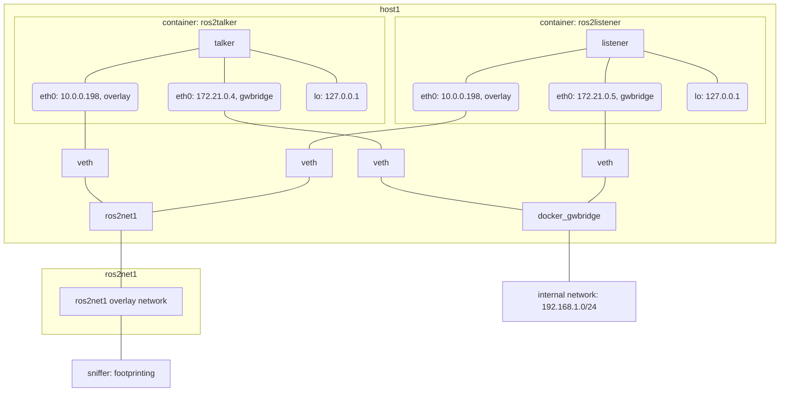

Lets now create another overlay network (`ros2net1`), make the listener connect to both and see whether we can stablish communication. Architecturally, this is better understood with the following diagram:

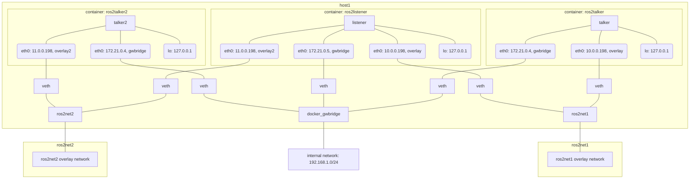

Executing this translates to the following:

```bash
# in Terminal (terminal 1), initialize first a swarm
docker swarm init
# in Terminal (terminal 1), create the network overlay
docker network create -d overlay \
  --subnet=10.0.0.0/24 \
  --gateway=10.0.0.1 \
	--ip-range 10.0.0.192/27 \
  --attachable \
  ros2net1
# in Terminal (terminal 1), create the network overlay2
docker network create -d overlay \
  --subnet=11.0.0.0/24 \
  --gateway=11.0.0.1 \
	--ip-range 11.0.0.192/27 \
  --attachable \
  ros2net2

# in another Terminal (terminal 2), let's create a container participating in the network ros2net1 as a talker
docker run -it --rm --network ros2net1 --name ros2talker osrf/ros2:nightly ros2 run demo_nodes_cpp talker
# in another Terminal (terminal 3), let's create a container participating in the network ros2net2 as a talker
docker run -it --rm --network ros2net2 --name ros2talker2 osrf/ros2:nightly ros2 run demo_nodes_cpp talker

# in another Terminal (terminal 4), , let's create a container participating in the networks ros2net1 and ros2net2 as a listener
# NOTE: with docker run, it seems it's not possible to connect to two networks at launch
#       see https://github.com/moby/moby/issues/29265#issuecomment-265909198
docker run -it --rm --network ros2net1 --name ros2listener osrf/ros2:nightly /bin/bash
## (inside the docker container) connect to network ros2net2
docker network connect ros2net2 ros2listener # inspect with docker container inspect ros2listener
## (inside the docker container) run listener
ros2 run demo_nodes_cpp listener
```

Another alternative is to create the container, configure it and then start it:
```bash
docker create --network ros2net1 --name ros2listener osrf/ros2:nightly ros2 run demo_nodes_cpp listener
docker network connect ros2net2 ros2listener
docker start ros2listener
```

Finally, cleanup:

```bash
docker network rm ros2net1
docker network rm ros2net2
```


Listener can now indeed rerceive packages from both talkers in different VXLANs however the talkers can't communicate with each other just yet because each VXLAN is associated with a different network interface. We need to forward multicast traffic.

Dedicated a few hours to this setup. Two hurdles found:
- Routing requires either `pimd` or `smcroute`. Got stucked trying to enable `smcroute` and didn't move forward given the complexity already of the setup.
- FastRTPS uses TTL=1 by default. Complex network archictectures will require to modify this in ROS 2 (or directly in FastRTPS) either via XML or instantiating a different transport for discovery.

The following links helped during the process:
- **general**
  - https://serverfault.com/questions/957386/multicast-traffic-across-vlan
  - https://serverfault.com/questions/322466/how-to-share-multicast-traffic-to-many-vlans
  - https://serverfault.com/questions/924475/receive-multicast-frames-from-different-subnets
  - https://stackoverflow.com/questions/37214608/docker-receiving-multicast-traffic
- **pimd**
  - https://github.com/troglobit/pimd
  - http://freshmeat.sourceforge.net/projects/pimd
  - https://community.cisco.com/t5/switching/multicasting-across-vlans/td-p/1434554
- **smcroute**
  - https://github.com/troglobit/smcroute
  - https://troglobit.com/howto/multicast/
- **FastRTPS issues with TTL**
  - https://github.com/eProsima/Fast-RTPS/pull/65
  - https://github.com/eProsima/Fast-RTPS/issues/143

Im stopping here but just in case I want to re-engage, steps to reproduce the setup:
```bash
# in Terminal (terminal 1), initialize first a swarm
docker swarm init
# in Terminal (terminal 1), create the network overlay
docker network create -d overlay \
  --subnet=10.0.0.0/24 \
  --gateway=10.0.0.1 \
	--ip-range 10.0.0.192/27 \
  --attachable \
  ros2net1
# in Terminal (terminal 1), create the network overlay2
docker network create -d overlay \
  --subnet=11.0.0.0/24 \
  --gateway=11.0.0.1 \
	--ip-range 11.0.0.192/27 \
  --attachable \
  ros2net2
# in another Terminal (terminal 2), let's create a container participating in the network ros2net1 as a talker
docker run -it --rm --network ros2net1 --name ros2talker osrf/ros2:nightly ros2 run demo_nodes_cpp talker
# in another Terminal (terminal 3), let's create a container participating in the network ros2net2 as a listener
docker run -it --rm --network ros2net2 --name ros2listener osrf/ros2:nightly ros2 run demo_nodes_cpp listener
# Finally, in another Terminal (terminal 4), we need to set up a machine to route the traffic between subnetworks
docker run -it --rm --network ros2net1 --name router osrf/ros2:nightly /bin/bash
 # in Terminal (terminal 1), connect to the other network
docker network connect ros2net2 router
# Now, set up smcrouted or pimd and launch it
... (here's where I failed)
```

### Additional experimentation with VXLANs and encryption

```bash
# in Terminal (terminal 1), initialize first a swarm
docker swarm init
# in Terminal (terminal 1), create the network overlay
docker network create -d overlay \
  --subnet=10.0.0.0/24 \
  --gateway=10.0.0.1 \
	--ip-range 10.0.0.192/27 \
  --attachable \
  ros2net1
# in Terminal (terminal 1), create the network overlay2
docker network create --opt encrypted -d overlay \
  --subnet=11.0.0.0/24 \
  --gateway=11.0.0.1 \
	--ip-range 11.0.0.192/27 \
  --attachable \
  ros2net2
# in another Terminal (terminal 2), let's create a container participating in the network ros2net1 as a talker
docker run -it --rm --network ros2net1 --name ros2talker osrf/ros2:nightly ros2 run demo_nodes_cpp talker
# in another Terminal (terminal 3), let's create a container participating in the network ros2net2 as a listener
docker run -it --rm --network ros2net2 --name ros2listener osrf/ros2:nightly ros2 run demo_nodes_cpp listener
# Finally, in another Terminal (terminal 4), we need to set up a machine to route the traffic between subnetworks
docker run -it --rm --network ros2net1 --name router osrf/ros2:nightly /bin/bash
 # in Terminal (terminal 1), connect to the other network
docker network connect ros2net2 router
# Now, set up smcrouted or pimd and launch it
... (here's where I failed)
```

### Script (and images) for speech about `ROS 2 Reconnaissance`

#### Diagrams
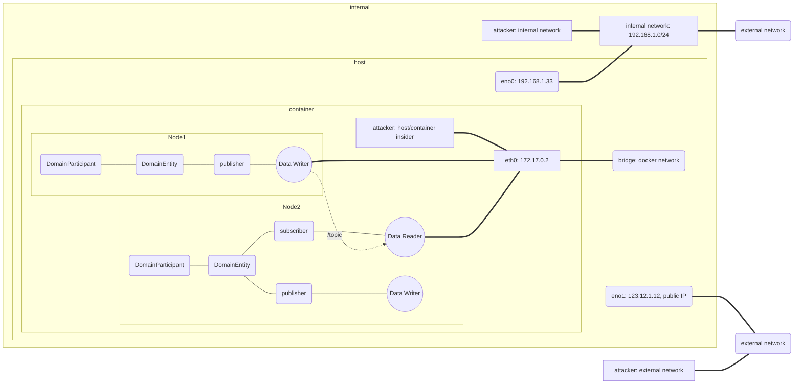

For the internal network:

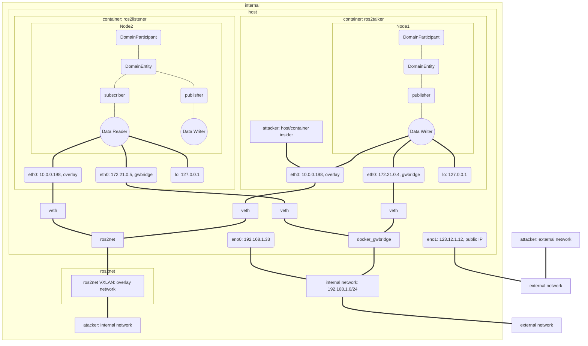

#### Code snippets

```bash
# in Terminal (terminal 1), initialize first a swarm
docker swarm init
# in Terminal (terminal 1), create the network overlay
docker network create -d overlay \
  --subnet=10.0.0.0/24 \
  --gateway=10.0.0.1 \
	--ip-range 10.0.0.192/27 \
  --attachable \
  overlay

# in another Terminal (terminal 2), launch demo
rocker --network overlay rosswg/turtlebot3_demo "byobu -f configs/reconnaissance_demo/unsecure.conf attach"

# in another Terminal (terminal 3), launch another container
docker run -it --rm --network overlay --name aztarna rosswg/turtlebot3_demo /bin/bash

# in Terminal 1, cleanup
docker network rm overlay
```

### Crafting RTPS packages

For crafting RTPS packages, we'll inspect the use of https://github.com/aliasrobotics/scapy/. A first attempt to implement RTPS disection and crafting is available at https://github.com/aliasrobotics/aztarna/pull/33/files.

#### Understanding scapy
Started with some background info:
- https://scapy.readthedocs.io/en/latest/usage.html#interactive-tutorial
  - Terribly nice plots https://scapy.readthedocs.io/en/latest/usage.html#graphical-dumps-pdf-ps


## Resources
- [1] https://docs.docker.com/network/macvlan/
- [2] https://docs.docker.com/network/network-tutorial-macvlan/
- [3] https://blog.oddbit.com/post/2018-03-12-using-docker-macvlan-networks/
- [4] https://blog.oddbit.com/post/2014-08-11-four-ways-to-connect-a-docker/
- [5] https://github.com/jpetazzo/pipework
- [6] (Old fashioned, see macvlan now) Docker - Create a Bridge and Shared Network https://gist.github.com/rpherrera/9481400fe25586f010402402ff24db20
- [7] https://runnable.com/docker/basic-docker-networking
- [8] https://www.docker.com/blog/understanding-docker-networking-drivers-use-cases/
- [9] https://www.quora.com/What-the-difference-between-a-VPN-and-VXLAN-network
- [10] https://docs.docker.com/network/network-tutorial-overlay/
- [11] https://www.aerospike.com/docs/deploy_guides/docker/networking/
- [12] https://www.youtube.com/watch?v=nGSNULpHHZc
- [13] https://success.docker.com/article/networking#userdefinedbridgenetworks
- [14] https://medium.com/@NTTICT/vxlan-explained-930cc825a51
- [15] https://developers.redhat.com/blog/2018/10/22/introduction-to-linux-interfaces-for-virtual-networking/
- [16] https://en.wikipedia.org/wiki/Multicast_address
- [17] https://tools.ietf.org/html/rfc2365
- [18] https://success.docker.com/article/networking#externalaccessforstandalonecontainers
- [19] https://blog.d2si.io/2017/04/25/deep-dive-into-docker-overlay-networks-part-1/ (also available parts 2 and 3)
- [20] https://neuvector.com/network-security/docker-swarm-container-networking/